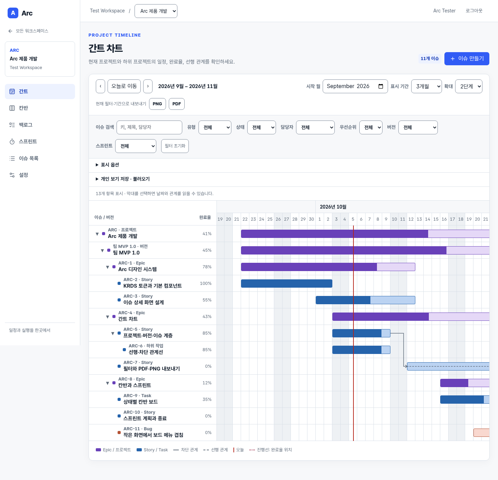
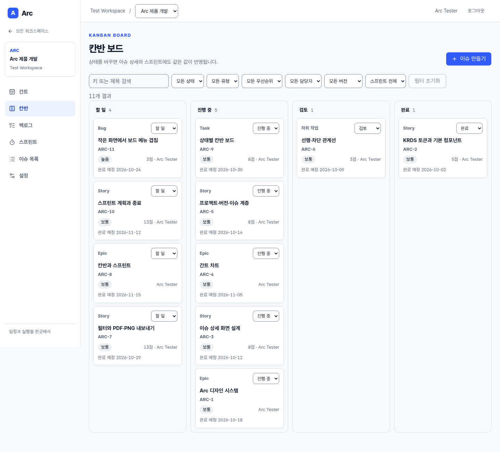

# Arc

Arc는 소규모 팀이 하나의 이슈를 간트 차트, 칸반 보드, 스프린트에서 함께 관리하는 웹 앱입니다. Epic·Story·Task·Bug·하위 작업의 계층, 버전과 이슈 관계, 일정과 진행률을 연결합니다.





## 주요 기능

- **간트:** 프로젝트·버전·Epic·하위 이슈 계층, 일정·완료율·오늘 선·주말·선행/차단 관계, 월 이동·확대, 필터·개인 보기 저장, PNG/PDF 출력
- **이슈:** Epic/Story/Task/Bug/하위 작업, 담당자·우선순위·기한·버전, 댓글·변경 기록·이슈 관계, 검색·필터
- **칸반과 스크럼:** 상태별 보드, 백로그 정렬·스프린트 편성, 스프린트 시작·종료와 이력
- **팀 관리:** 이메일 가입·검증·로그인, 워크스페이스 초대, 역할 및 프로젝트 설정

GitHub·GitLab 연결은 [설계 기준](docs/INTEGRATIONS.md)을 마련한 후속 기능입니다. 현재 릴리스에서 저장소 연결이나 웹훅은 제공하지 않습니다.

## Get started

필요한 도구: **Java 21**, **Node.js 20 이상**, **Docker Compose**. 로컬 DB는 MySQL 8.4, 개발용 메일함은 Mailpit입니다.

```bash
cp .env.example .env
# .env의 DB_PASSWORD와 MYSQL_ROOT_PASSWORD를 각자 변경
docker compose up -d
```

첫 번째 터미널에서 API를 실행합니다. `DB_PASSWORD`는 `.env`에 입력한 값과 같아야 합니다.

```bash
cd backend
DB_PASSWORD=choose-a-local-password ./gradlew bootRun
```

두 번째 터미널에서 웹 앱을 실행합니다.

```bash
cd frontend
npm ci
npm run dev
```

`http://localhost:5173`에서 가입한 뒤 `http://localhost:8025`의 Mailpit에서 확인 메일을 열어 이메일을 검증하세요. 로그인 후 워크스페이스와 프로젝트를 만들 수 있습니다. API는 `localhost:8080`, MySQL은 `localhost:3307`에서 실행됩니다. 운영 환경에서는 실제 SMTP 설정과 HTTPS 주소를 환경 변수로 지정해야 합니다.

`frontend/index.html`은 Vite가 React를 불러오는 시작 파일입니다. 파일을 직접 열면 브라우저 모듈 제한으로 앱이 표시되지 않을 수 있으므로 개발 서버 주소를 사용하세요. 로그인 없이 화면 구조를 검토하려면 [독립형 디자인 시안](frontend/public/design-preview.html)을 직접 열거나 개발 서버의 `/design-preview.html`로 접속할 수 있습니다. 재기획 방향은 [디자인 재기획 v2](docs/DESIGN_REPLAN.md)에 기록했습니다.

## 기술 구성

| 영역 | 기술 |
| --- | --- |
| 웹 | React 19, TypeScript, Vite, Tailwind CSS v4, shadcn/ui, TanStack Query·Table·Router |
| API | Kotlin, Spring Boot 4, Exposed DSL 및 Spring JDBC, Flyway |
| 저장·메일 | MySQL 8.4, 로컬 Mailpit |
| 디자인 | KRDS를 바탕으로 확장한 [Arc 디자인 가이드](docs/DESIGN_GUIDE.md) |

## 검증과 문서

```bash
(cd frontend && npm run build)
(cd backend && ./gradlew check)  # Python 3 필요: 패키지 경계 검사 포함
python3 scripts/smoke.py  # API, MySQL, Mailpit 실행 필요
```

- [기능 명세](docs/FUNCTIONAL_SPEC.md) · [명세 대비 구현 현황](docs/STATUS.md)
- [Redmine 간트 기준](docs/GANTT_REFERENCE.md) · [팀용 MVP 계획](docs/PLAN.md)
- [백엔드 구조](docs/BACKEND_ARCHITECTURE.md) · [작업 목록](docs/TODO.md)
