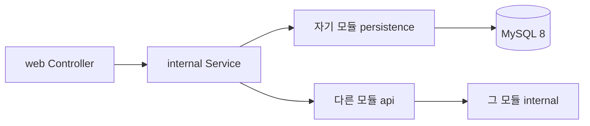

# Arc 백엔드 구조

> 2026-10-05 · Kotlin / Spring Boot · 하나의 Gradle 애플리케이션 안에서 기능별 경계를 유지한다.

## 설계 방향

사용자가 공유한 **백엔드 구조 비교** 대화의 캐시 미리보기를 참고했다. 전체 대화 및 handoff 파일은 이번 환경에서 읽을 수 없었으므로, 확인 가능한 원칙인 기능별 구조, `api/internal` 경계, 필요에 따른 QueryService, 과도한 추상화 방지를 Arc에 적용했다.

Arc는 modular monolith로 시작한다. 배포 단위는 하나이며 기능 모듈은 Kotlin 패키지로 구분한다. 독립적인 빌드·배포나 컴파일 경계가 실제로 필요해질 때 Gradle 모듈로 분리한다.

```text
backend/src/main/kotlin/io/arcapp/backend/
├── ArcBackendApplication.kt
├── bootstrap/config/          # Spring Security, Exposed 연결 구성
├── shared/
│   ├── api/                   # 공통 오류 계약
│   ├── web/                   # HTTP 오류 응답, 인증된 사용자 추출
│   ├── persistence/           # JDBC 공통 기능
│   └── security/              # 토큰 생성·해시
├── identity/
│   ├── api/                   # SessionAuthenticator, IdentityDirectory
│   ├── web/                   # AuthController
│   └── internal/
│       ├── IdentityService.kt
│       ├── IdentityCommands.kt
│       └── persistence/       # 사용자·토큰 저장
├── workspace/                 # 팀·멤버·초대·소유권
│   ├── api/                   # WorkspaceAccess
│   ├── web/
│   └── internal/persistence/
├── project/                   # 프로젝트 계층·키·보관·버전
│   ├── api/                   # ProjectAccess, ProjectTimelineQueries
│   ├── web/
│   └── internal/persistence/
├── issue/                     # 이슈·계층·댓글·활동·관계·스프린트 참여 이력
│   ├── api/                   # IssueTimelineQueries, SprintIssueOperations
│   ├── web/
│   └── internal/
│       ├── IssueService.kt
│       ├── IssueQueryService.kt
│       └── persistence/
├── sprint/                    # 계획·시작·종료
│   ├── web/
│   └── internal/persistence/
├── gantt/                     # 공개 조회 계약을 조합한 통합 간트
│   ├── web/
│   └── internal/              # GanttQueryService; 직접 DB 접근 없음
├── savedview/                 # 사용자별 간트 보기
│   ├── web/
│   └── internal/persistence/
└── mail/
    ├── api/                   # MailSender 외부 시스템 포트
    └── internal/client/       # SMTP 구현
```

## 디렉터리의 의미

| 위치 | 책임 | 규칙 |
| --- | --- | --- |
| `web` | 경로·요청 바인딩·현재 사용자 추출 | 업무 규칙과 DB 처리는 서비스에 위임 |
| `api` | 다른 기능 모듈에 공개하는 호출·데이터 계약 | HTTP API라는 의미가 아님. 외부 모듈은 이 패키지만 참조 |
| `internal` | 유스케이스·권한·검증·트랜잭션 조정 | 같은 기능의 web/api에서만 사용 |
| `internal/persistence` | SQL·Exposed Table·저장·조회·잠금 | 다른 모듈의 저장소나 Table을 import하지 않음 |
| `internal/client` | SMTP·GitHub·GitLab 등의 외부 HTTP/SDK 호출 | 기능 모듈의 공개 포트를 통해 호출 |
| `internal/storage` | 파일 저장소 adapter | 파일 기능이 생길 때 추가 |
| `internal/messaging` | 이벤트 발행·수신 adapter | 비동기 처리가 생길 때 추가 |

필요한 디렉터리만 생성한다. 간트처럼 데이터를 조합하는 기능에는 자체 저장소가 없다. `shared`에는 기능별 정책을 넣지 않는다.

## 요청 흐름과 모듈 경계



- 이슈 생성: `IssueController → IssueService → ProjectAccess / WorkspaceAccess → IssueRepository`.
- 스프린트 종료: `SprintService`가 프로젝트 권한과 상태를 검증한 뒤 `SprintIssueOperations`로 참여 이력·포인트·미완료 이월을 처리한다. 스프린트 모듈이 이슈 저장소를 직접 호출하지 않는다.
- 간트 조회: `GanttQueryService → ProjectTimelineQueries + IssueTimelineQueries`. 프로젝트 하위 트리와 이슈·관계를 통합한다.
- 인증 필터는 `SessionAuthenticator`를 호출하고, 메일 발송은 `MailSender`를 호출한다.

## 트랜잭션과 저장 기술

기존 동작을 보존하기 위해 현재 저장 계층은 **Exposed DSL과 Spring JDBC를 함께 사용**한다. 멤버 관리·저장된 보기는 Exposed, 인증·프로젝트·이슈·스프린트는 기존 JDBC SQL이다. ORM 세부사항은 모두 persistence 안에 둔다. 후속 Exposed 전환도 이 경계 안에서 진행한다.

- JDBC 쓰기 유스케이스의 `@Transactional`은 Service에 둔다. 스프린트 종료 이력·이슈 이동·종료 상태가 같은 Spring 트랜잭션에서 커밋된다.
- 프로젝트 변경은 프로젝트 행 잠금으로 직렬화한다. 이슈 번호 발급, 계층·관계 변경, 스프린트 시작·종료의 경합을 보호하고 이슈의 낙관적 버전 검사를 유지한다.
- `ProjectAccess.forUpdate`와 `SprintIssueOperations`의 쓰기는 호출하는 Service의 트랜잭션 안에서 실행한다.
- Exposed 저장소의 원자적 작업은 자체 `transaction`을 사용한다. JDBC와 Exposed 쓰기를 하나의 유스케이스에서 혼합하지 않는다. 멤버·소유권 변경은 잠금 후 권한과 상태를 재검사한다.
- 스키마 변경은 기존 Flyway 마이그레이션으로 관리한다.

## 구조를 확장하는 기준

- QueryService는 검색·페이지 조회나 여러 기능의 조회 조합에 사용한다. 단순 단건 조회에는 별도 클래스를 의무화하지 않는다.
- Handler는 독립적인 변경 흐름이나 복잡한 분기가 서비스의 책임을 흐릴 때 도입한다. 작업마다 파일을 하나씩 만드는 규칙은 두지 않는다.
- 인터페이스는 외부 시스템 경계나 실제로 여러 구현이 필요할 때 둔다. 모든 Service·Repository에 인터페이스를 만들지 않는다.
- 별도 읽기 DB·이벤트 저장소가 필요하기 전에는 Full CQRS를 도입하지 않는다.
- GitHub·GitLab 구현 시 `integration/api`, `internal/client`, 웹훅 `web`을 둔다. 이슈 연결은 `issue/api` 계약으로 처리하며 상세 범위는 [연동 명세](INTEGRATIONS.md)를 따른다.

## 검증

```bash
python3 scripts/check_backend_boundaries.py
cd backend
./gradlew check
```

경계 검사는 디렉터리와 패키지 일치, 다른 모듈의 internal 참조 금지, web의 DB 직접 접근 금지, HTTP 타입의 서비스 유입 금지, 기능 모듈 의존 순환을 검사한다. 이는 패키지 규칙을 검사하는 정적 도구이며 Gradle의 컴파일 격리를 대신하지 않는다. API 동작은 실행 중인 MySQL·메일 환경에서 `python3 scripts/smoke.py`로 검증한다.
