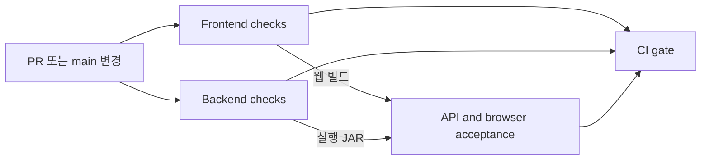

# Arc CI

> 기준일: 2026-10-06 · GitHub Actions / Ubuntu 24.04

2026-10-06에 [main 실행 #37341400334](https://github.com/jujoycode/Arc/actions/runs/37341400334)의 네 job이 모두 성공했다. 강제 충돌 테스트의 요청 가로채기 수명과 재실행 시 artifact 교체를 보완한 상태다.

## 검사 구성

| 검사 | 실행하는 작업 | 잡아내는 문제 |
| --- | --- | --- |
| Frontend checks | Node 24, pnpm 11.19.0 고정 설치, lint, 기능 경계·TypeScript 검사, Vite 빌드 | 잠금 파일 불일치, 잘못된 의존·타입·경로, 빌드 실패 |
| Backend checks | Java 21, Gradle wrapper 검증, 패키지 경계 검사, `check bootJar` | 모듈 경계 위반, 컴파일·검사·패키징 실패 |
| API and browser acceptance | 새 MySQL 8.4·Mailpit, 생성한 실행 JAR와 웹 번들, API·Chromium 수용 검사 | 마이그레이션, 인증·권한·트랜잭션, 화면과 서버 연결, 간트 출력·스프린트·모바일 회귀 |
| CI gate | 앞의 세 검사 결과 확인 | 실패하거나 건너뛴 필수 검사를 성공으로 처리하는 문제 |



프런트·백엔드 검사는 병렬로 실행한다. 수용 검사는 생성된 빌드 파일을 다운로드해 실행하며 다시 빌드하지 않는다. 프런트는 Vite preview로 정적 빌드 결과를 제공한다.

## 실행 조건과 유지 관리

- `main` 대상 PR, `main` push, Actions 화면의 수동 실행을 지원한다.
- 경로 필터를 두지 않아 문서만 바뀐 PR에도 완료된 검사 결과가 남는다.
- 같은 PR·브랜치에서 새 실행이 시작되면 이전 실행을 취소한다.
- 외부 Actions는 확인한 커밋 SHA로 고정한다. Dependabot이 매주 Actions 갱신 PR을 만든다.
- pnpm 버전은 `frontend/package.json`의 `packageManager`를 따르며 `--frozen-lockfile`로 설치한다.
- pnpm 저장소와 Gradle 캐시를 사용한다. Gradle 캐시 쓰기는 main으로 제한한다.
- Gradle 배포 파일 SHA-256을 wrapper 설정에 고정한다.
- 프런트 10분, 백엔드 15분, 수용 검사 20분의 실행 제한을 둔다.

## 데이터와 권한

DB와 메일함은 각 실행에서 생성하고 종료 후 제거하는 서비스 컨테이너다. 워크플로의 비밀번호는 임시 DB 전용 값이다. 운영 DB·SMTP·GitHub·GitLab 자격 증명은 필요하지 않다.

저장소 권한은 `contents: read`다. checkout은 인증 정보를 작업 디렉터리에 남기지 않는다. PR 코드는 `pull_request` 이벤트에서 검사한다.

API 검사는 팀 격리, 초대·역할·소유권, 동시 번호 발급, 낙관적 잠금, 관계 순환, 스프린트, 보관 정책을 확인한다. 브라우저 검사는 실제 생성·편집, 공통 필터, 간트 집계·저장 보기·PNG/PDF, 실패 복원·충돌 입력 보존, 멤버 권한, 모바일 키보드 조작을 확인한다.

현재 Gradle에는 별도 단위 테스트가 없다. API·브라우저 검사를 함께 필수 검사로 둔다. lint의 기존 경고는 출력하되 실패로 처리하지 않는다.

## 결과와 실패 조사

[Arc Actions](https://github.com/jujoycode/Arc/actions/workflows/ci.yml)에서 단계별 로그를 확인한다. 빌드와 검증 자료는 7일 동안 보관한다.

- `frontend-build`: 검증에 사용한 웹 번들
- `backend-build`: 검증에 사용한 실행 JAR
- `acceptance-artifacts`: 서버·프런트·API·브라우저 로그, 간트 PNG/PDF 출력
- 브라우저 실패 시 `acceptance-artifacts/browser/failure.png`와 `trace.zip`
- Gradle 실패 시 보고서가 생성되었다면 `backend-diagnostics`

추적 파일을 다운로드한 뒤 요청·화면·조작 순서를 확인한다.

```bash
cd frontend
pnpm exec playwright show-trace /path/to/trace.zip
```

## 로컬 재현

Java 21, Node 24, pnpm, Python 3, curl, Linux의 `setsid`가 필요하다. [README](../README.md)의 MySQL·Mailpit을 준비하고 8080·5173 포트의 다른 앱 실행을 종료한다.

```bash
pnpm --dir frontend install --frozen-lockfile
pnpm --dir frontend lint
pnpm --dir frontend build
(cd backend && ./gradlew --no-daemon check bootJar)
pnpm --dir frontend exec playwright install --with-deps chromium
set -a
source .env
set +a
bash scripts/ci/acceptance.sh backend/build/libs/arc-backend-0.0.1-SNAPSHOT.jar
```

스크립트는 `.ci-artifacts/`에 자료를 남기고 자신이 시작한 API·웹 프로세스를 정리한다. 이미 사용 중인 포트는 거부한다. 다른 포트는 `ARC_CI_API_PORT`, `ARC_CI_WEB_PORT`, `DB_URL`, `SMTP_PORT`, `ARC_MAIL_URL`로 지정한다. `CHROMIUM_PATH=''`는 설치한 Playwright Chromium을 사용하며, 특정 시스템 브라우저 경로도 지정할 수 있다.

## 추가하면 좋은 검사

1. **병합 보호:** `CI gate`를 main의 필수 상태 검사로 등록한다. 워크플로와 브랜치 보호 설정은 각각 관리한다.
2. **보안 검사:** CodeQL과 의존성 취약점 검사를 별도 워크플로로 추가한다. 대응 기준을 정한 뒤 실패 기준을 조정한다.
3. **단위·DB 테스트:** 날짜 집계와 계층 규칙, 트랜잭션·잠금처럼 변경 위험이 큰 부분부터 추가한다.
4. **대량 데이터:** 간트·보드·백로그 응답 시간과 브라우저 표시 비용을 측정한다. PR 기능 검사와 분리한 수동·정기 실행이 적합하다.
5. **접근성과 배포:** 디자인 시스템 재구성과 함께 접근성 검사를 추가한다. 운영 대상이 확정되면 환경별 배포·상태 확인을 연결한다.
