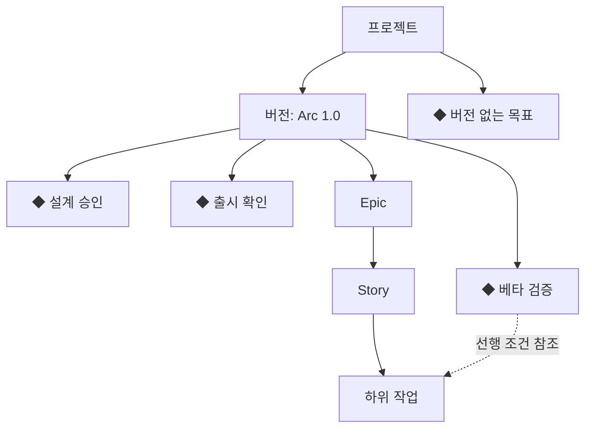

# arcat 마일스톤 기획

> 작성일: 2026-10-07 (Asia/Seoul) · 상태: 추천 설계, 구현 대기 · 근거: [공식 기능 비교와 현행 구현 조사](MILESTONE_RESEARCH.md)

## 1. 추천 방향

**버전은 배포할 작업의 범위, 마일스톤은 확인해야 할 달성 시점으로 구분한다.** 기존 버전과 Epic·Story 계층을 유지하고 독립적인 마일스톤을 추가한다. 프로젝트에 직접 속하거나 선택적으로 버전에 연결되며, 같은 버전에 여러 마일스톤을 둘 수 있다.

예를 들어 `arcat 1.0` 버전에 ‘설계 승인 10/12’, ‘베타 검증 10/23’, ‘출시 확인 10/31’을 연결한다. 베타와 출시가 같은 선행 이슈를 참조해도 이슈의 버전을 옮기거나 간트에서 이슈를 복제하지 않는다. 출시 확인을 달성했다고 버전의 배포나 연결 이슈의 상태가 자동으로 바뀌지 않는다.

| 선택지 | 장점 | 제약 | 판단 |
| --- | --- | --- | --- |
| 현재 버전을 그대로 마일스톤으로 사용 | 변경이 가장 작음 | 한 릴리스의 여러 체크포인트를 표현하려면 버전과 이슈 배정을 나눠야 함 | 현행 호환 동작으로만 유지 |
| 기존 버전에 RELEASE / MILESTONE 종류 추가 | 기존 FK 재사용 | 릴리스와 체크포인트의 관계·상태·선행 이슈가 하나의 배정 필드에 섞임 | 추천하지 않음 |
| 독립 Milestone + 선택적 Version 연결 | 배포 범위와 달성 시점을 각각 관리; 하나의 릴리스에 여러 목표 가능 | 새 저장소·관리 화면 필요 | **추천** |

독립 체크포인트와 복수 선행 이슈는 arcat의 제품 선택이다. GitLab의 작업당 단일 마일스톤 배정을 그대로 복제하는 설계가 아니다.

## 2. 개념과 책임

| 개념 | 답하는 질문 | arcat에서의 표현 |
| --- | --- | --- |
| Epic / Story / Task | 무엇을 해야 하는가? | 기존 이슈 계층·상태·완료율 |
| Sprint | 언제 집중해서 수행하는가? | 기존 기간과 편성 |
| Version | 어떤 배포 범위에 포함하는가? | 기존 `versionId`와 버전 날짜 |
| Milestone | 어떤 날짜에 무엇이 확인되어야 하는가? | 명시적 목표일·담당자·달성 조건·실제 달성일 |

마일스톤은 작업 기간이나 이슈 유형을 갖지 않는다. 시작일 없는 이슈와 시작일=완료일인 하루짜리 작업도 일반 이슈다. 기존 ‘시작일 없음 → ◆’ 추론을 명시적 마일스톤 표식과 구분한다.

## 3. 첫 구현 범위

- 프로젝트별 마일스톤 생성·조회·편집, 담당자, 목표일, 설명·달성 기준.
- 선택적 버전 연결과 선행 이슈 연결. 한 이슈가 여러 체크포인트의 선행 조건이 될 수 있다.
- 계획 / 달성 / 취소, 달성·재개·취소의 사유와 변경 기록, 실제 달성일.
- 간트의 마일스톤 행·계획/실제 ◆, 버전 완료일의 ‘버전 목표’ 표식, 상세 탐색·표시 옵션·출력.
- 선행 작업 완료 수, 미완료·삭제된 참조·기한 위험 안내. 작업 완료와 목표 달성을 구별.
- 기존 버전·이슈 날짜·필터·개인 보기·중첩 접기를 보존하는 마이그레이션과 수용 검증.

후속 범위는 버전의 배포 수명주기, 여러 보기의 마일스톤 필터, 상단 날짜 요약, SCM 개발 증빙, 여러 프로젝트 목표 및 외부 마일스톤 매핑이다.

## 4. 사용자 흐름

1. 관리자 또는 소유자가 프로젝트의 ‘마일스톤’ 화면이나 간트의 ‘마일스톤 추가’를 연다.
2. 이름·목표일·달성 기준을 입력하고 담당자와 버전을 선택한다. 버전 없이 ‘계약 승인’ 같은 프로젝트 목표도 등록한다.
3. 선행 이슈를 고른다. 예를 들어 ‘베타 검증’에는 테스트·주요 버그 수정·검증 환경 준비를 연결한다. 같은 프로젝트의 다른 버전이나 버전 미지정 작업도 선행 조건이 될 수 있다.
4. 팀원은 기존 이슈 화면·보드에서 업무를 처리한다. 마일스톤 상세는 최신 선행 작업 완료 수와 남은 작업을 보여 준다.
5. 관리자가 실제 검증 후 ‘달성 기록’을 실행한다. 계획일은 유지하고 실제 달성일과 증빙 메모를 기록한다.
6. 일정을 바꾸면 기존 목표일·새 목표일·변경 사유를 남긴다. 이미 달성한 항목의 기준을 변경하려면 사유를 입력해 재개한 뒤 편집한다.

한 담당자가 여러 마일스톤을 조정할 수 있다. 담당자 지정은 관리 권한을 부여하지 않으며, 멤버 담당자는 이슈 진행·댓글 등 기존 협업 권한을 사용한다.

## 5. 상태·달성·진척 규칙

| 저장 상태 | 의미 | 허용 동작 |
| --- | --- | --- |
| PLANNED — 계획 | 목표를 준비·검증 중 | 편집·선행 조건 변경·달성·취소 |
| ACHIEVED — 달성 | 관리자가 실제 확인을 기록 | 조회·사유를 포함한 재개 |
| CANCELLED — 취소 | 목표를 수행하지 않기로 결정 | 조회·사유를 포함한 재개 |

- 기한 초과는 별도 저장 상태가 아니다. 계획 상태이고 `목표일 < 기준 오늘`이면 ‘기한 초과’를 함께 표시한다. 날짜가 지났거나 선행 이슈가 전부 DONE이라고 자동 달성하지 않는다.
- 첫 버전의 날짜 판단은 서버의 `ARC_BUSINESS_TIME_ZONE` 기준이며 기본은 `Asia/Seoul`로 제안한다. 목표일·실제 달성일은 DATE, 기록 시각은 UTC로 저장한다. 브라우저 시간대가 달라도 달력 날짜를 이동시키지 않는다. 워크스페이스별 시간대는 후속 확장이다.
- 선행 이슈의 실제 상태 DONE을 기준으로 ‘선행 작업 완료 6/8’처럼 표시한다. 수동 완료율 100%만으로 DONE이라고 판단하지 않는다.
- Epic·부모 이슈를 연결하면 현재의 말단 이슈를 선행 작업으로 펼쳐 계산한다. 부모와 자식을 함께 연결해도 말단 ID로 중복을 제거한다. 자식 없는 항목은 자신을 센다. 계획 중 자식 추가·변경은 최신 범위에 반영하고, 완료 수와 함께 포함 작업 목록을 제공한다.
- ‘선행 작업 완료율’은 업무 범위의 준비 지표다. 기존 버전·이슈 완료율을 대체하거나 마일스톤 달성률이라고 부르지 않는다. 선행 이슈가 0개면 `— / 수동 검증`을 표시한다.
- 기본 달성은 유효한 선행 작업이 모두 DONE인 경우에 가능하다. 미완료·삭제 참조가 있으면 관리자가 비어 있지 않은 예외 사유를 입력해야 한다. 선행 이슈가 없으면 검증 메모가 필요하다. 예외 달성은 상세·이력에 표시한다.
- 달성 시 연결 범위·유효 말단 이슈·상태·완료 수·예외 사유의 스냅샷을 저장한다. 이후 이슈 재개·삭제·자식 추가가 과거 달성 기록을 소급 변경하지 않는다. 현재 이슈 변화가 있으면 별도 안내한다.
- 삭제된 연결 항목을 조용히 빼서 완료율을 올리지 않는다. 부모 범위의 삭제된 하위 항목도 무효 참조로 표시하고 연결 조정 또는 예외 사유를 요구한다. 신규·삭제 범위 변화는 기존 이슈 활동과 함께 확인한다.
- 실제 달성일 기본값은 기준 오늘이다. 과거 날짜는 입력 가능하고 미래 날짜는 거부한다. 목표보다 이른 달성도 허용한다. 달성의 재개·취소는 사유 필수이며 이슈·스프린트·버전 상태를 바꾸지 않는다.
- 미완료 선행 작업의 기한이 목표보다 늦으면 ‘목표 이후 예정’, 날짜가 없으면 ‘일정 미지정’으로 안내한다. 기존 버전 상속 날짜를 사용할 때는 출처를 표시한다. 이를 확률 기반 예측이나 배포 실패로 표현하지 않는다.

## 6. 간트·화면·디자인

실선은 간트 표시 계층, 점선은 상세에서 조회하는 선행 조건이다. 마일스톤이 이슈의 부모가 되는 구조가 아니다. 선행 이슈는 원래 부모 아래에 한 번만 표시한다.

| 항목 | 간트 표시 규칙 |
| --- | --- |
| 일반 이슈 | 시작·완료일이 있으면 기존 막대. 완료일만 있으면 ‘기한만 지정’ 표식으로 구분하고 ◆ 마일스톤으로 해석하지 않음 |
| 버전 | 기존 기간 막대 유지; 시작일 유무와 관계없이 완료일에 ‘버전 목표’ 표식. 독립 마일스톤의 달성과 혼동하지 않음 |
| 계획 마일스톤 | 목표 날짜에 속이 빈 ◆; 명시적 ‘마일스톤’ 종류·상태 텍스트 |
| 달성 마일스톤 | 계획일 보존. 실제 달성일이 다르면 계획일의 빈 ◆와 실제 날짜의 채운 ◆를 함께 표시; 같은 날짜면 하나의 결합 표식 |
| 취소 마일스톤 | 기본 보기에서 숨김; 포함 옵션에서는 취소 문구·선 모양으로 구분 |
| 기한 초과 | 계획 상태와 ‘기한 초과’ 배지를 함께 표시; 색만으로 구분하지 않음 |

- 버전 연결 마일스톤은 해당 버전의 직계 자식 행, 미연결 마일스톤은 해당 프로젝트의 직계 자식 행이다. 각 그룹에서 목표일·ID 순으로 마일스톤을 배치하고 기존 이슈 트리 순서를 유지한다.
- 프로젝트·버전을 접으면 자식 마일스톤도 숨긴다. Epic을 접어도 그 Epic 밖의 마일스톤은 유지한다. 마일스톤은 말단 표시 행이고 자체 접기나 이슈 자식 행은 없다. 현재 GANTT-07의 중첩 상태 보존 규칙을 그대로 따른다.
- 마일스톤은 기간·업무 완료율 집계나 이슈 관계선·진행선의 대상에서 제외한다. 프로젝트의 표시 기간에는 마일스톤 날짜를 반영할 수 있지만 버전의 명시적 목표일과 이슈 일정은 바꾸지 않는다.
- 버전과 마일스톤의 날짜가 다르더라도 자동으로 서로 이동시키지 않는다. 버전 기간 밖의 연결 목표에는 안내를 제공한다.
- 표시 기간 밖의 목표는 행에 ‘기간 밖’과 날짜를 안내하고 해당 위치의 ◆는 그리지 않는다. 달성일만 기간 안에 있으면 실제 표식만 그린다.
- 좌측 행과 타임라인 ◆를 선택하면 동일한 상세를 연다. 이름·상태·계획/실제 날짜·담당자·달성 기준·선행 작업·이력을 제공하고 관련 이슈로 이동한다.
- 유형 ‘마일스톤’과 이름 검색을 제공한다. 상태·유형·스프린트 등의 이슈 필터를 마일스톤 상태로 강제 변환하지 않는다. 기본 표시 옵션 `마일스톤 표시`와 `버전 목표 표시`는 켜짐으로 제안하고 개인 보기에 저장한다. 기존 보기에는 기본값을 적용한다.
- 마일스톤 자체 조건과 관련 이슈 조회는 구분한다. 여러 보기에서의 ‘이 마일스톤 선행 작업만 조회’ 공통 필터는 2차 범위다.
- KRDS 기반 arcat 의미 토큰, 48px 행과 기존 입력·대화상자를 재사용한다. 색과 함께 빈/채운 ◆·상태 문구·취소 표시를 사용한다. 타임라인의 네이티브 버튼은 키보드 포커스와 계획/실제 날짜를 읽는 접근성 이름을 제공한다.
- PNG/PDF에는 현재 보이는 행·표식·선택 옵션·필터·기간만 포함한다. 고정된 현행 72px 헤더와 48px 행 계산을 검증한다. 상단 목표 요약 띠를 도입할 때는 헤더 높이와 PDF 페이지 분할을 함께 변경한다.
- 같은 날짜의 목표는 별도 행으로 겹침을 피한다. Jira·GitHub처럼 상단에 목표를 요약하는 방식은 2차 단계에서 선택 옵션으로 제공한다.

## 7. 데이터와 API의 설계안

| 저장소 | 핵심 필드 | 규칙 |
| --- | --- | --- |
| `milestones` | id, project_id, version_id?, title, description?, acceptance_criteria, target_date, owner_id?, status, achieved_on?, achieved_at?, achieved_by?, revision, created_at, updated_at | 하나의 프로젝트, 선택적 같은 프로젝트 버전; 제목 1~120자; 목표일·달성 기준 필수; 낙관적 버전 |
| `milestone_issues` | milestone_id, issue_id, created_by, created_at | 같은 프로젝트의 선행 조건; 복합 유일 키; 한 이슈가 여러 마일스톤에 연결 가능 |
| `milestone_activities` | id, milestone_id, actor_id, event_type, payload, created_at | 생성·일정 변경·연결 변경·달성·취소·재개; 변경 전후와 사유, 달성 시 증빙 스냅샷 |

완료 수·기한 초과·현재 위험은 조회 계산값으로 시작한다. 이력 payload는 버전이 있는 스키마로 제한하고 전체 이슈 설명이나 비밀값을 복사하지 않는다. 버전의 `dueDate`는 계획 목표일로 유지하며 마일스톤 추가가 기존 FK나 이슈 배정을 변경하지 않는다.

| API 설계안 | 목적 |
| --- | --- |
| GET / POST `/api/projects/{projectId}/milestones` | 목록·생성 |
| GET / PATCH `/api/projects/{projectId}/milestones/{id}` | 상세·수정, revision 검사 |
| PUT `/api/projects/{projectId}/milestones/{id}/prerequisites` | 선행 조건 목록 교체, 중복 제거·범위 검증 |
| POST `/api/projects/{projectId}/milestones/{id}/achieve` | actualDate·검증 메모·선택적 예외 사유와 revision으로 달성 기록 |
| POST `/api/projects/{projectId}/milestones/{id}/cancel` 또는 `/reopen` | 사유와 revision을 포함한 상태 전환 |
| GET `/api/projects/{projectId}/milestones/{id}/activities` | 페이지별 이력 |
| 기존 GET `/api/projects/{projectId}/gantt` 확장 | 권한 확인된 프로젝트·하위 프로젝트의 milestones 추가 |

설계안의 경로·필드는 구현 단계에서 기존 API 관례에 맞춰 확정한다. 첫 범위에서는 영구 삭제 대신 취소와 이력을 제공한다.

- 모든 워크스페이스 멤버는 조회 가능하다. 생성·편집·선행 조건 변경·달성·취소·재개는 관리자와 소유자만 수행한다. 보관된 프로젝트는 읽기 전용이다.
- 담당자는 같은 워크스페이스 멤버여야 한다. 버전·선행 이슈는 같은 프로젝트만 허용한다. 이력·간트·하위 프로젝트 조회에서도 서버가 권한을 확인한다.
- 편집·달성은 revision을 검사하고 충돌 시 409로 응답한다. UI는 입력을 보존하고 최신 상태와 함께 재시도할 수 있어야 한다.
- 달성 시 프로젝트 → 마일스톤 순서의 잠금과 같은 Spring 트랜잭션에서 권한·연결 범위·이슈 상태를 재확인하고 상태와 이력을 원자적으로 기록한다. 기존 이슈 쓰기 경로의 프로젝트 잠금 참여를 실제 MySQL에서 확인한다.

## 8. 구조와 호환 전환

마일스톤은 독립 수명주기·저장소가 있으므로 기존 단일 Spring Boot 애플리케이션 안에 `milestone` 기능 패키지를 제안한다. `web`은 HTTP, `internal`은 유스케이스·Exposed 저장소, `api`는 간트용 읽기 계약을 맡는다. 별도 Gradle 모듈이나 CQRS 프레임워크를 추가하지 않는다.

의존 방향은 `milestone → project/workspace/issue의 api`, `gantt → milestone의 api`로 둔다. 이슈 범위·상태·삭제 참조 읽기는 issue의 공개 조회 계약으로 제공하고 milestone에서 issue의 internal Table·Repository를 import하지 않는다. issue가 milestone을 거꾸로 호출하는 구조는 만들지 않는다. 2차 공통 필터도 마일스톤 조회가 공개 이슈 조회를 조합하는 방식으로 순환을 피한다.

프런트는 `features/milestone`의 공개 진입점으로 목록·상세·연결 UI를 제공하고 shared의 UI·통신·토큰을 재사용한다. issue·settings·gantt가 이 진입점을 조합하되 milestone에서 issue 화면을 런타임 import해 순환하지 않는다. 필요한 이슈 선택은 자체 UI와 공개 조회 DTO로 처리한다. 업무 이슈 종류와 마일스톤 상태를 분리한 간트 행 모델을 사용한다. `milestone-{id}` 행 ID와 해당 기능의 라우팅을 사용하며 이슈 상세로 잘못 이동하지 않도록 한다.

1. 기존 `versions`·이슈의 `version_id`·시작일·기한을 유지하고 마일스톤 테이블을 추가한다.
2. 날짜가 짧거나 시작일이 없다는 이유만으로 기존 버전을 마일스톤으로 자동 변환하지 않는다.
3. 설정의 기존 영역은 ‘버전’, 새 목록과 입력은 ‘마일스톤’으로 구분한다. 기존 버전 기반 ◆는 ‘버전 목표’로 설명한다.
4. 기존 개인 보기 JSON과 API 소비자를 보존하고 새 옵션의 누락 시 기본값을 사용한다. 기존 간트 날짜 상속과 이슈 계층의 회귀를 검사한다.
5. 구현 후 실제 1920×1080 제품 화면과 README 안내를 갱신한다. 현재 README는 이 기획의 미구현 기능을 구현된 것처럼 표시하지 않는다.

## 9. 단계별 구현·커밋 계획

| 단계 | 작업 단위 | 완료 판단 |
| --- | --- | --- |
| 1 — 모델·경계 | Flyway, Exposed, 명시적 날짜·상태·권한 계약, CRUD·이력 | 새 설치·기존 DB 업그레이드, 팀 격리·보관·revision 충돌 검사 |
| 2 — 달성 규칙 | 선행 조건·말단 중복 제거·무효 참조·수동 검증·달성 스냅샷 | 실제 MySQL의 동시 변경·부분 실패 롤백, 과거 달성 보존 |
| 3 — 관리 UI | 목록·추가·상세·연결·달성·취소·재개 | 관리자/멤버 동작, 입력 보존과 재시도, 페이지·빈 상태 |
| 4 — 간트 | 명시적 ◆, 버전 목표, 일반 기한 구분, 접기·필터·보기·PNG/PDF | 같은 날짜·기간 경계·계획/실제 차이·중첩 접기·내보내기 검사 |
| 5 — 제품 검증 | 접근성·반응형·대량 데이터·스크린샷·CI | 기존 전체 수용 흐름 유지, 자동 검사와 실기기 확인 범위 기록 |

각 단위의 검증 완료 후 커밋한다. 이 문서·명세·TODO는 기획 완료이며 위 단계의 앱 구현은 아직 시작하지 않았다.

2차: 여러 보기의 선행 작업 필터, 상단 목표 요약, 버전 편집·배정 잠금·배포 기록, 기존 GitHub/GitLab의 커밋·PR·MR 개발 증빙 조회. PR 병합만으로 마일스톤을 달성시키지 않는다. 현재 연동에 없는 빌드·배포 증빙은 별도 이벤트 지원이 필요하다.

3차: 여러 프로젝트의 통합 목표와 공유 권한, 외부 Milestone/Release 매핑·동기화 정책. 제공자별 작업당 단일 마일스톤과 arcat의 복수 선행 조건 관계가 달라 자동 양방향 동기화를 기본값으로 삼지 않는다.

## 10. 필수 수용 시나리오

1. 같은 버전에 설계 승인·베타·출시 목표를 만들어도 기존 이슈 배정과 계층이 바뀌지 않는다.
2. 버전 없는 프로젝트 목표와 담당자를 생성하고 날짜·달성 기준을 수정할 수 있다.
3. 시작일 없는 일반 이슈와 명시적 마일스톤, 시작일 있는 버전 목표를 구별한다.
4. Epic과 자식이 함께 선행 조건에 있어도 말단 작업은 한 번씩 집계한다. 0개일 때 100%로 표시하지 않는다.
5. 완료율 100%지만 상태 REVIEW인 작업은 준비 완료로 세지 않는다. 모든 선행 작업 DONE이어도 관리자의 달성 기록 전에는 계획이다.
6. 미완료·삭제 참조·수동 검증에 필요한 사유 없이 달성할 수 없다. 예외 달성에는 사유와 증빙 스냅샷이 남는다.
7. 날짜 연기는 전후 목표일과 사유를 보존하고, 늦은 달성은 기존 목표일과 실제 날짜를 함께 읽을 수 있다.
8. 기한 초과는 서버 기준 날짜에서 계산되고 시간대가 다른 브라우저에서도 같은 날짜를 표시한다.
9. 달성 후 이슈 재개·삭제·자식 추가가 과거 달성을 변경하지 않으며 마일스톤 재개 이력이 남는다.
10. 중첩된 프로젝트·버전 접기는 마일스톤을 숨기고 다시 펼칠 때 기존 하위 이슈의 접힘 상태를 유지한다.
11. 같은 날 여러 목표·기간 시작/끝·계획일/실제일 중 하나만 기간 안에 있는 경우에도 표식이 겹치거나 잘리지 않는다.
12. 새 옵션이 없는 저장 보기와 기존 버전 날짜 상속이 유지되고 PNG/PDF는 보이는 목표와 상태를 포함한다.
13. 멤버·다른 팀·보관 프로젝트의 쓰기를 서버가 거부한다. revision 충돌은 입력 보존·오류 안내·재시도가 가능하다.
14. 달성과 선행 이슈 변경의 동시 요청에서 잠금·트랜잭션이 판단과 기록을 일치시킨다. 중간 실패가 상태나 이력만 남기지 않는다.
15. 키보드·색 이외의 상태 구별·360/768/1280px·200% 상당 재배치·고대비와 대량 조회를 검사한다.

수용 시나리오의 테스트와 구현 상태는 [기능 명세](FUNCTIONAL_SPEC.md), [TODO](TODO.md), [STATUS](STATUS.md)에서 추적한다.
