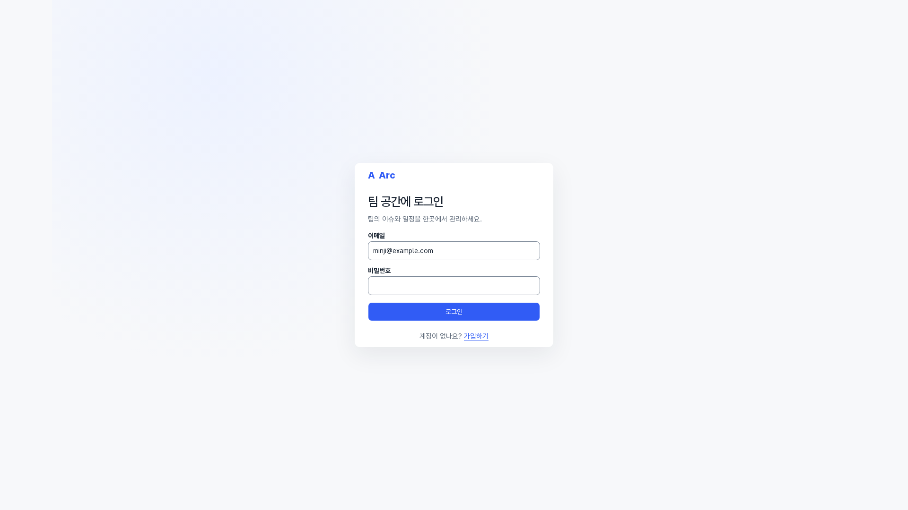
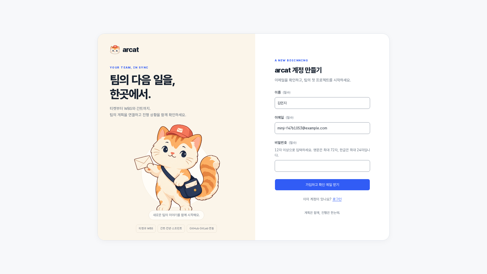
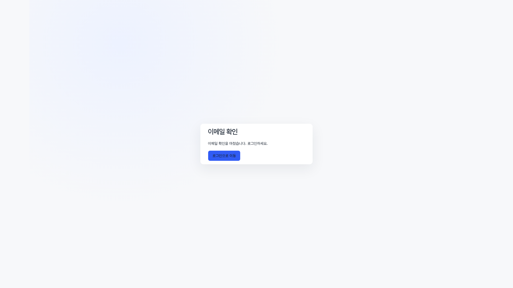
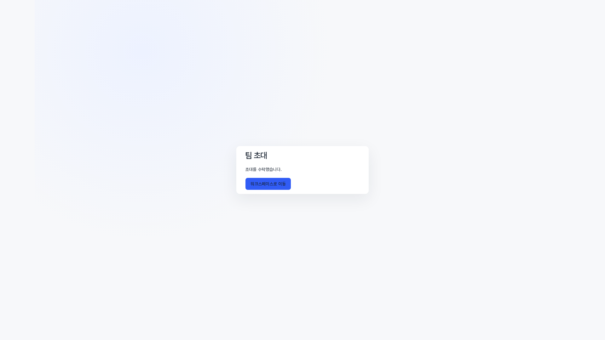
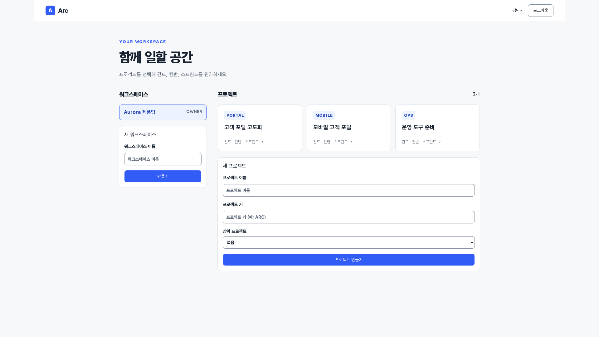
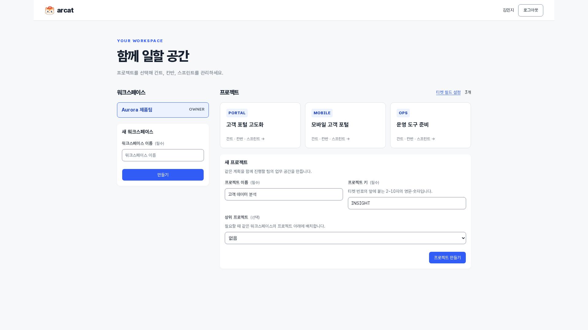

# 팀 공간 시작하기

[제품 소개](README.md) · [전체 기능 안내](FEATURES.md)

가입과 이메일 확인을 거쳐 팀에 합류하고 워크스페이스·프로젝트를 선택합니다.

> 2026-10-08 · Asia/Seoul · 실제 앱 촬영 · 모든 원본 1920×1080

사진을 누르면 원본을 볼 수 있습니다. 동일한 데모 팀의 업무 흐름을 순서대로 촬영했으며 스프린트 종료·보관 전후에는 상태가 달라집니다.

## 이메일 로그인

검증된 이메일로 팀 공간에 접속합니다.

**사용자:** 모든 사용자 · **화면:** `/login` · 화면 상단

이 기능에서 할 수 있는 일:

- 이메일·비밀번호 로그인
- 가입 화면 이동

## 계정 가입

이름과 이메일로 계정을 만들고 확인 메일을 받습니다.

**사용자:** 모든 사용자 · **화면:** `/register` · 화면 상단

이 기능에서 할 수 있는 일:

- 이름·이메일·비밀번호 입력
- 12자 이상 비밀번호
- 이메일 확인 후 로그인

## 이메일 확인 완료

실제 확인 메일의 일회용 링크로 이메일을 검증합니다.

**사용자:** 가입 사용자 · **화면:** `/verify` · 화면 상단

이 기능에서 할 수 있는 일:

- 확인 링크 검증
- 확인 결과 안내
- 로그인으로 이동

## 팀 초대 수락

초대받은 이메일로 로그인한 뒤 팀에 합류합니다.

**사용자:** 초대받은 팀원 · **화면:** `/invite` · 화면 상단

이 기능에서 할 수 있는 일:

- 초대 이메일 일치 확인
- 초대 수락 결과
- 워크스페이스로 이동

## 워크스페이스와 프로젝트 선택

팀 공간과 프로젝트를 선택하고 프로젝트 간 이동을 시작합니다.

**사용자:** 팀원·관리자 · **화면:** `/` · 화면 상단

이 기능에서 할 수 있는 일:

- 워크스페이스별 역할
- 프로젝트 카드
- 상위 프로젝트 지정
- 새 워크스페이스·프로젝트 생성

## 새 프로젝트 준비

프로젝트 이름·키·상위 프로젝트를 정해 관리 범위를 나눕니다.

**사용자:** 워크스페이스 소유자·관리자 · **화면:** `/` · 화면 상단

이 기능에서 할 수 있는 일:

- 프로젝트 키 입력
- 상위 프로젝트 선택
- 관리자 생성 권한
