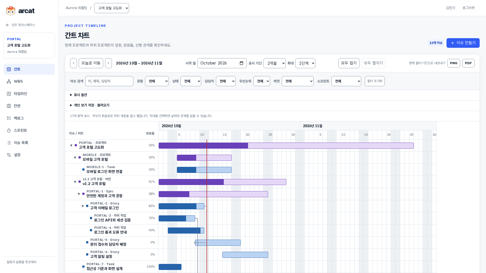
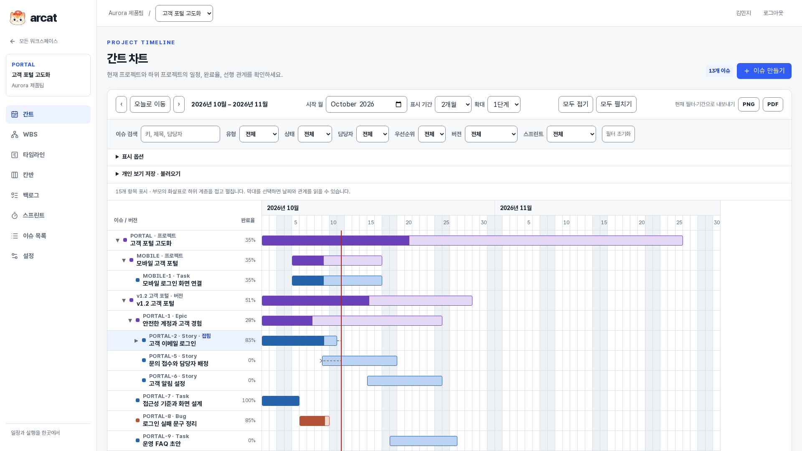
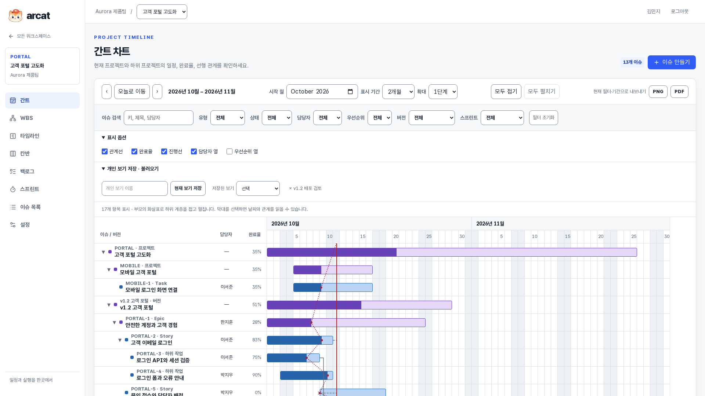
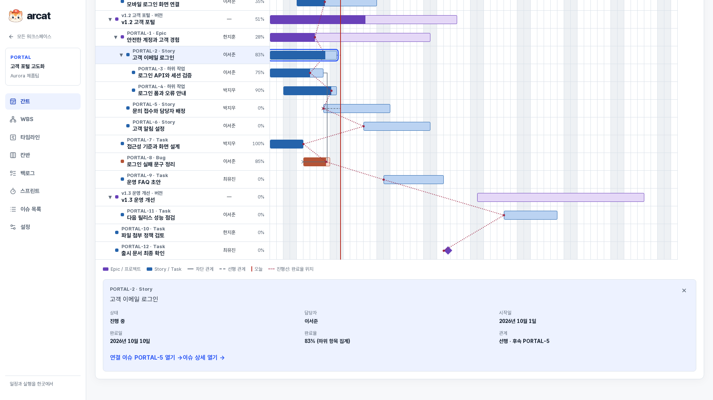
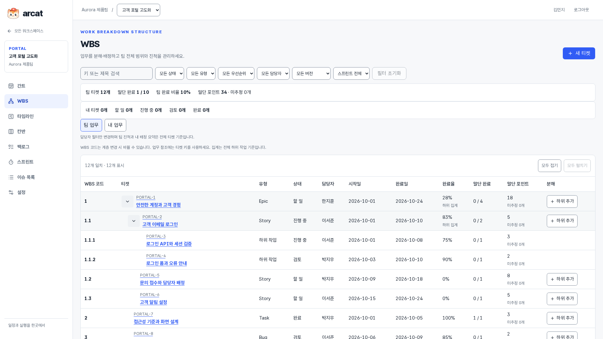
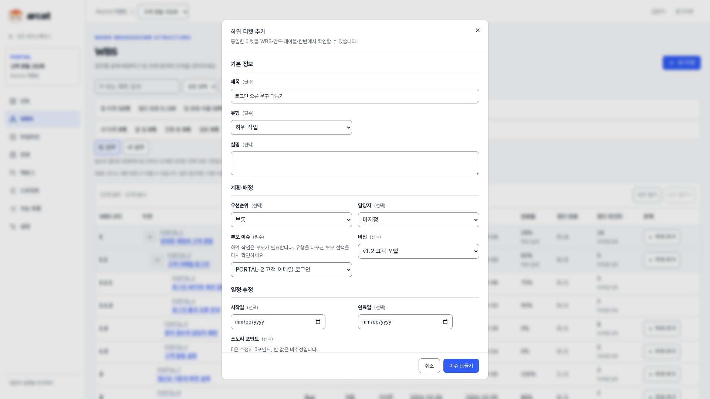
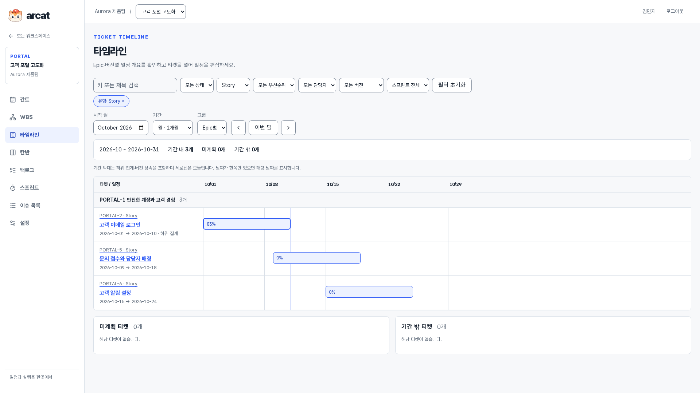
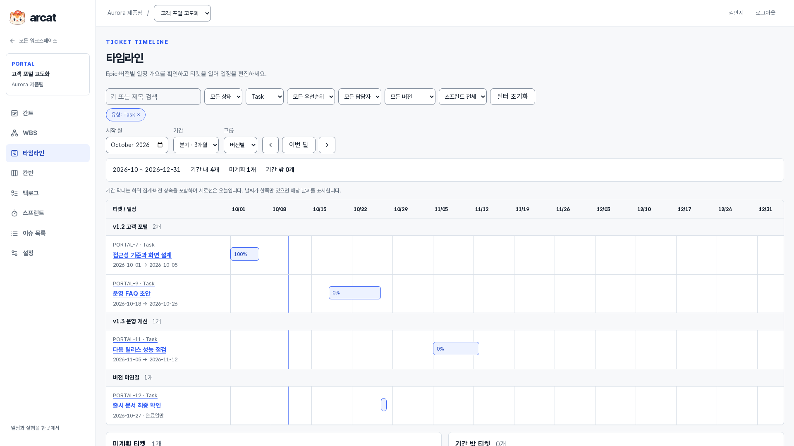
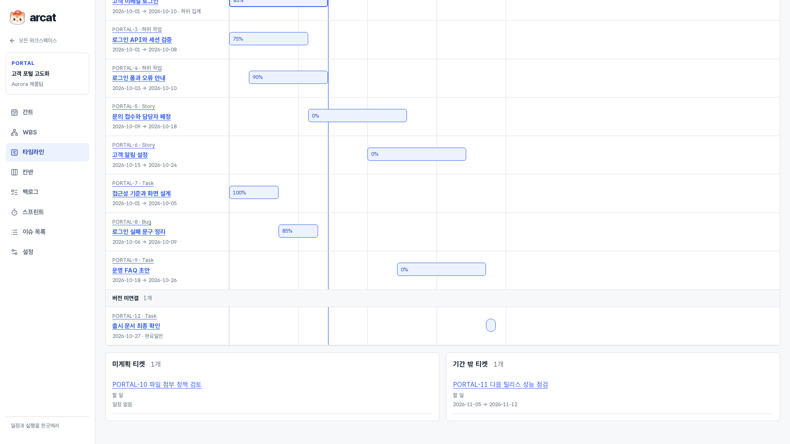

# WBS와 일정 계획

[제품 소개](README.md) · [전체 기능 안내](FEATURES.md)

관리자는 WBS로 범위와 배정을 정하고, 개발자는 내 업무와 팀 진척을 함께 봅니다. 같은 티켓을 간트와 타임라인에서 일정으로 확인합니다.

> 2026-10-11 · Asia/Seoul · 실제 앱 촬영 · 모든 원본 1920×1080

사진을 누르면 원본을 볼 수 있습니다. 동일한 데모 팀의 업무 흐름을 순서대로 촬영했으며 스프린트 종료·보관 전후에는 상태가 달라집니다.

WBS 완료 비율은 말단 티켓의 완료 상태로 계산합니다. 간트 집계 완료율과 서로 다른 지표입니다. 버전 목표 날짜는 현재 제공하며, 독립 마일스톤의 달성 관리는 [후속 기획](../MILESTONE_PLAN.md)입니다.

## 간트로 일정과 관계 확인

프로젝트·버전·티켓의 일정과 진행률, 선행·차단 관계를 한 화면에서 확인합니다.

**사용자:** 모든 팀원 · **화면:** `/projects/:projectId/gantt` · 화면 상단

이 기능에서 할 수 있는 일:

- 부모·자식 계층
- 기간·확대·월 이동
- 오늘·주말
- 버전 일정 상속
- 관계선
- PNG·PDF 출력

## 계층별 간트 접기

부모를 기준으로 자손을 접어 일정의 큰 흐름에 집중합니다.

**사용자:** 모든 팀원 · **화면:** `/projects/:projectId/gantt` · 화면 상단

이 기능에서 할 수 있는 일:

- 중첩 계층 접기
- 하위 접힘 상태 보존
- 부모 집계 유지
- 전체 접기·펼치기

## 간트 옵션과 개인 보기

반복해서 확인할 필터·기간·표시 옵션을 개인 보기로 저장합니다.

**사용자:** 모든 팀원 · **화면:** `/projects/:projectId/gantt` · 화면 상단

이 기능에서 할 수 있는 일:

- 진행선·완료율·관계선
- 담당자·우선순위 열
- 개인 보기 저장·불러오기·삭제
- 현재 보이는 계층 출력

## 간트 선택 항목 상세

일정 항목을 선택해 속성과 관계를 읽고 원래 티켓으로 이동합니다.

**사용자:** 모든 팀원 · **화면:** `/projects/:projectId/gantt` · 화면 하단 기능으로 스크롤

이 기능에서 할 수 있는 일:

- 선택 항목 상태·일정·담당자
- 연결 티켓 탐색
- 공통 티켓 상세 이동

## 관리자의 WBS 계획

범위를 분해하고 담당자를 배정하며 팀의 말단 완료와 추정 현황을 확인합니다.

**사용자:** 기본·프로젝트 관리자 · **화면:** `/projects/:projectId/wbs` · 화면 상단

이 기능에서 할 수 있는 일:

- 계층 코드
- 팀 완료 비율·포인트·미추정
- 접기·필터
- 티켓·하위 작업 생성
- 상세 계획 편집

## WBS 하위 티켓 추가

선택한 부모 아래로 작업을 분해하면서 같은 티켓을 다른 보기와 공유합니다.

**사용자:** 기본·프로젝트 관리자 · **화면:** `/projects/:projectId/wbs` · 화면 상단

이 기능에서 할 수 있는 일:

- 부모·유형 기본값
- 버전 연결
- 담당자·일정·포인트
- 서버 계층 검증

## 개발자의 내 업무와 팀 진척

내 담당 티켓과 부모 맥락을 보면서 팀 전체 진척을 함께 확인합니다.

**사용자:** 개발자 · **화면:** `/projects/:projectId/wbs` · 화면 상단

이 기능에서 할 수 있는 일:

- 팀 업무·내 업무 전환
- 내 티켓 상태별 수
- 조상 맥락
- 필터에도 팀 합계 유지
- 관리 조작 비노출

## Epic별 타임라인

Epic별 일정 개요를 읽고 기간 막대로 티켓 상세를 엽니다.

**사용자:** 모든 팀원 · **화면:** `/projects/:projectId/timeline` · 화면 상단

이 기능에서 할 수 있는 일:

- Epic 그룹
- 월 이동
- 하위 집계
- 날짜·진척 텍스트
- 상세 이동

## 버전별 분기 일정

릴리스 버전으로 일정을 묶고 3개월 범위에서 계획을 비교합니다.

**사용자:** 모든 팀원 · **화면:** `/projects/:projectId/timeline` · 화면 상단

이 기능에서 할 수 있는 일:

- 버전 그룹
- 1개월·3개월 기간
- 기간 경계 자르기
- 버전 일정 상속

## 미계획·기간 밖 업무

차트에 나타나지 않는 업무도 별도 목록에서 찾아 계획 누락을 확인합니다.

**사용자:** 모든 팀원 · **화면:** `/projects/:projectId/timeline` · 화면 하단 기능으로 스크롤

이 기능에서 할 수 있는 일:

- 미계획 목록
- 기간 밖 목록
- 한쪽 날짜 표식
- 상속 일정 역전 안내
