# 티켓 실행과 협업

[제품 소개](README.md) · [전체 기능 안내](FEATURES.md)

Epic·Story·Task·Bug·하위 작업은 공통 티켓의 유형입니다. 테이블·칸반·상세는 같은 티켓을 표시하며, 계획 변경과 담당 업무 실행 권한을 구분합니다. 팀이 정한 추가 정보와 필수 조건은 티켓 생성·계획 편집에 함께 적용합니다.

> 2026-10-11 · Asia/Seoul · 실제 앱 촬영 · 모든 원본 1920×1080

사진을 누르면 원본을 볼 수 있습니다. 동일한 데모 팀의 업무 흐름을 순서대로 촬영했으며 스프린트 종료·보관 전후에는 상태가 달라집니다.

## 담당 개발자의 실행 정보 수정

계획을 바꾸지 않고 담당 티켓의 상태와 완료율을 기록합니다.

[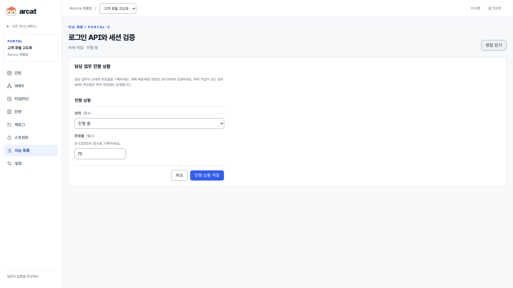](images/ticket-execution.png)

**사용자:** 담당자·관리자 · **화면:** `/projects/:projectId/issues/:issueId` · 화면 상단

이 기능에서 할 수 있는 일:

- 상태·완료율 전용 폼
- 담당자 검사
- 계획 필드 분리
- 다른 보기 반영

## 티켓 테이블

프로젝트 티켓을 조건별로 비교하고 정렬·페이지 조회합니다.

[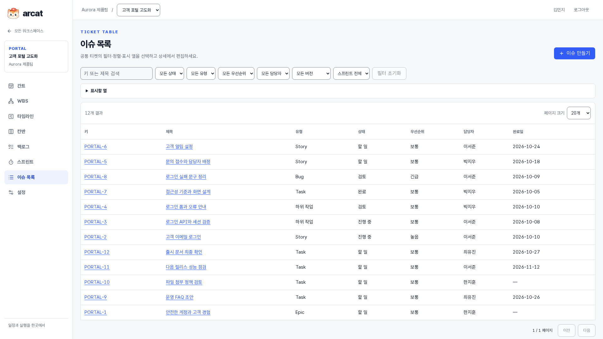](images/ticket-table.png)

**사용자:** 모든 팀원 · **화면:** `/projects/:projectId/issues` · 화면 상단

이 기능에서 할 수 있는 일:

- 키·제목 검색
- 상태·유형·우선순위·담당자·버전·스프린트 필터
- 서버 정렬·페이지
- 상세 이동

## 테이블 표시 열 선택

업무 비교에 필요한 열을 선택하고 같은 프로젝트 탐색 동안 유지합니다.

[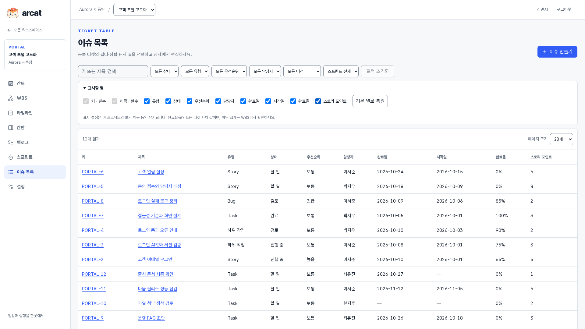](images/ticket-table-columns.png)

**사용자:** 모든 팀원 · **화면:** `/projects/:projectId/issues` · 화면 상단

이 기능에서 할 수 있는 일:

- 필수 키·제목 열
- 시작일·완료율·포인트
- 열 숨기기·기본값 복원
- 표시 설정 유지

## 공통 티켓 생성

Epic·Story·Task·Bug·하위 작업을 하나의 티켓 계약으로 생성합니다.

[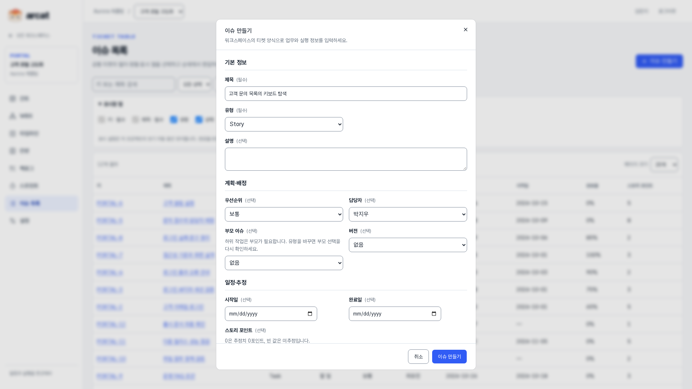](images/ticket-create.png)

**사용자:** 기본·프로젝트 관리자 · **화면:** `/projects/:projectId/issues` · 화면 상단

이 기능에서 할 수 있는 일:

- 기본 정보·계획·일정·진행 상황 그룹
- 필수·선택과 입력 안내
- 담당자·부모·버전·포인트
- 담당자 선택 시 집배원 고양이와 배정 안내
- 모든 보기에서 같은 키 사용

## 티켓 상세와 팀 협업

한 티켓에서 완료 기준·속성·댓글·변경 기록·관계·개발 활동을 확인합니다.

[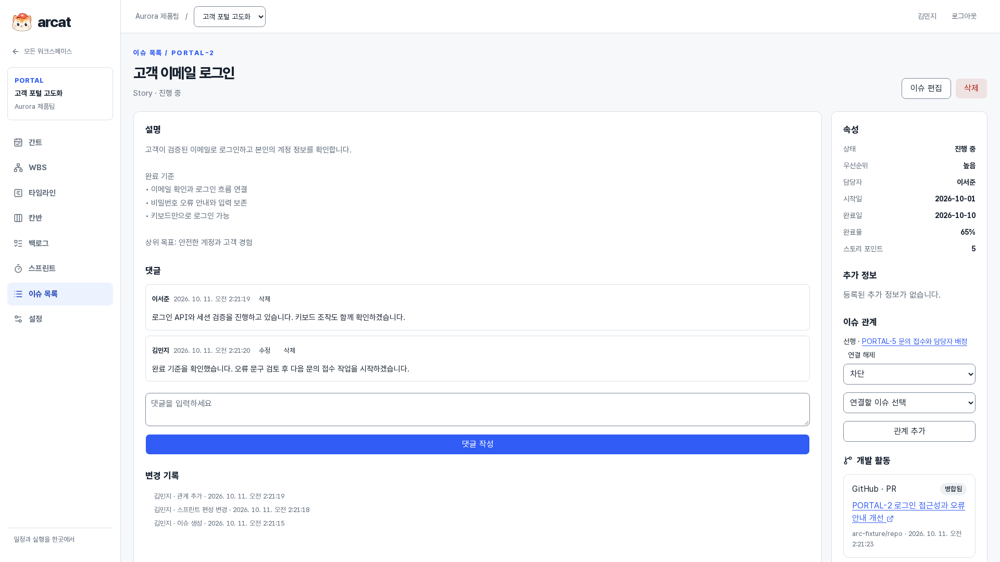](images/ticket-detail.png)

**사용자:** 모든 팀원 · **화면:** `/projects/:projectId/issues/:issueId` · 화면 상단

이 기능에서 할 수 있는 일:

- 설명·상태·담당자·일정
- 댓글 협업
- 변경 기록
- 선행·차단 관계
- 관리자 삭제

## 선행·차단 관계 연결

먼저 완료할 업무와 차단 관계를 연결하고 간트의 관계선으로 함께 확인합니다.

[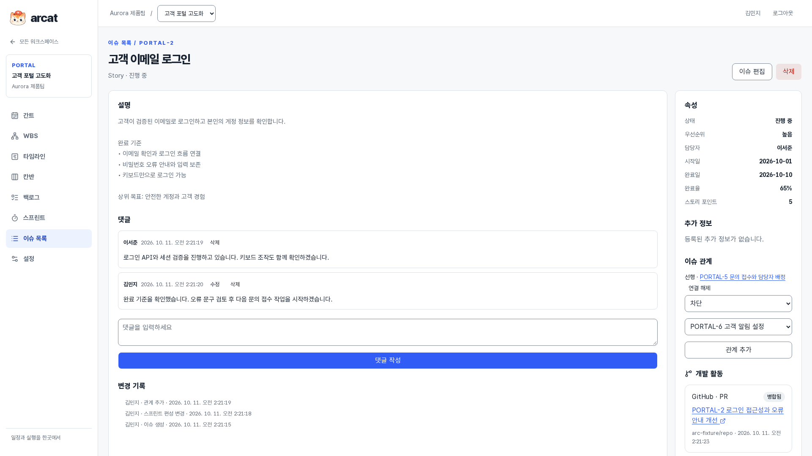](images/ticket-relations.png)

**사용자:** 기본·프로젝트 관리자 · **화면:** `/projects/:projectId/issues/:issueId` · 화면 상단

이 기능에서 할 수 있는 일:

- 선행·차단 선택
- 같은 프로젝트 티켓 연결
- 관계 순환 검증
- 관리자 연결 해제

## 티켓 변경 기록

업무의 생성·수정·관계·스프린트 편성 기록에서 작업한 사람과 시각을 확인합니다.

[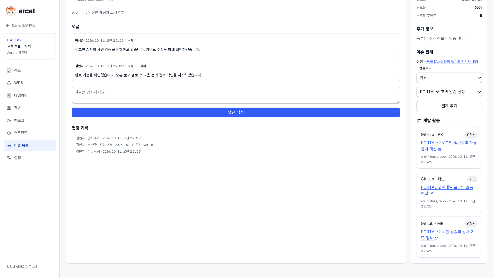](images/ticket-history.png)

**사용자:** 모든 팀원 · **화면:** `/projects/:projectId/issues/:issueId` · 화면 하단 기능으로 스크롤

이 기능에서 할 수 있는 일:

- 변경자·시각·작업 종류
- 계획·실행 변경 기록
- 댓글·개발 활동 함께 확인

## 댓글 수정과 협업 기록

모든 팀원이 댓글을 작성하고 작성자는 자신의 댓글을 수정·삭제합니다.

[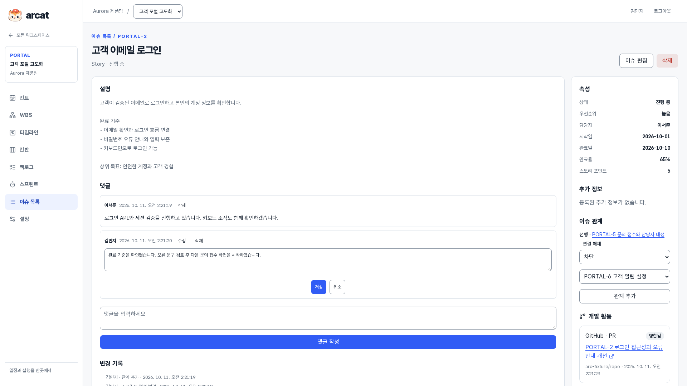](images/ticket-comment-edit.png)

**사용자:** 모든 팀원·댓글 작성자 · **화면:** `/projects/:projectId/issues/:issueId` · 화면 상단

이 기능에서 할 수 있는 일:

- 본인 댓글 편집
- 관리자 문제 댓글 삭제
- 다른 담당자의 업무에도 댓글
- 변경 기록

## 관리자의 티켓 계획 편집

담당자·일정·범위·계층·추정을 변경하고 모든 보기에 반영합니다.

[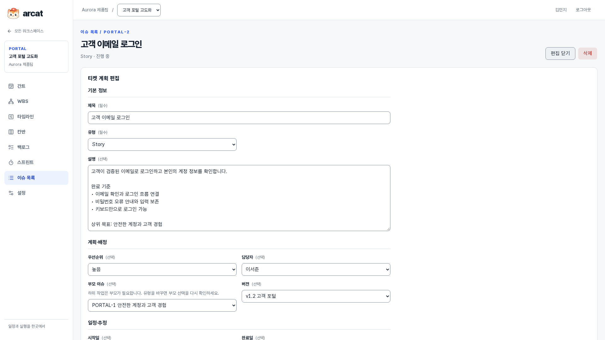](images/ticket-plan-edit.png)

**사용자:** 기본·프로젝트 관리자 · **화면:** `/projects/:projectId/issues/:issueId` · 화면 상단

이 기능에서 할 수 있는 일:

- 제목·설명·유형·우선순위
- 담당자·일정·포인트·부모·버전
- 계층·날짜 검증
- 낙관적 버전

## 동시 편집 충돌과 입력 보존

다른 사용자가 먼저 저장한 경우 충돌을 알리고 입력 내용을 보존합니다.

[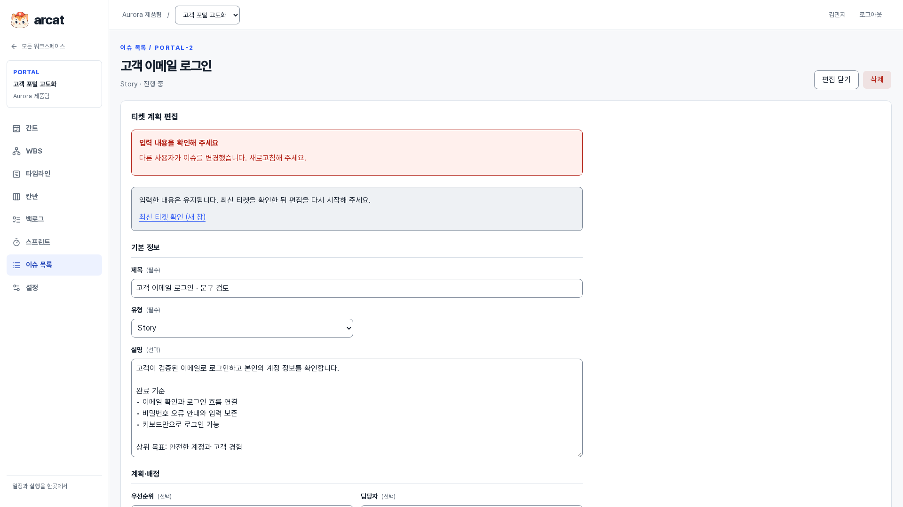](images/ticket-edit-conflict.png)

**사용자:** 편집 권한이 있는 사용자 · **화면:** `/projects/:projectId/issues/:issueId` · 화면 상단

이 기능에서 할 수 있는 일:

- version 충돌 안내
- 입력 보존
- 새 데이터 확인 후 재시도

## 칸반 상태별 실행

할 일·진행 중·검토·완료로 티켓을 나누고 실행 상태를 갱신합니다.

[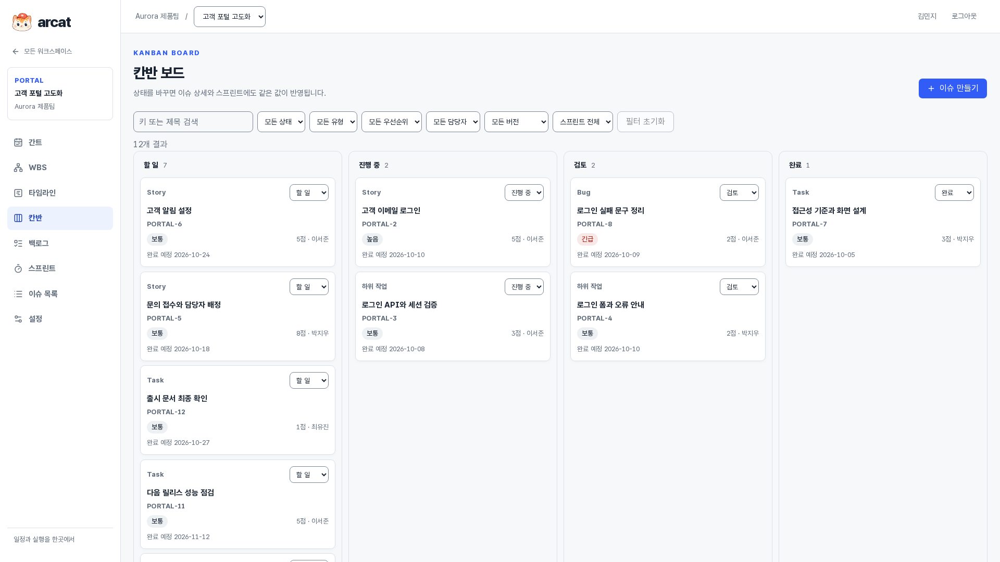](images/kanban.png)

**사용자:** 모든 팀원·담당자 · **화면:** `/projects/:projectId/board` · 화면 상단

이 기능에서 할 수 있는 일:

- 드래그·상태 메뉴
- 담당자·관리자만 변경
- 공통 필터
- 실패 시 상태 복원
- 상세·스프린트 동기화

## 티켓 계획에 팀별 추가 정보 입력

팀이 정한 필드와 필수 조건을 티켓 생성·계획 편집에 적용합니다.

[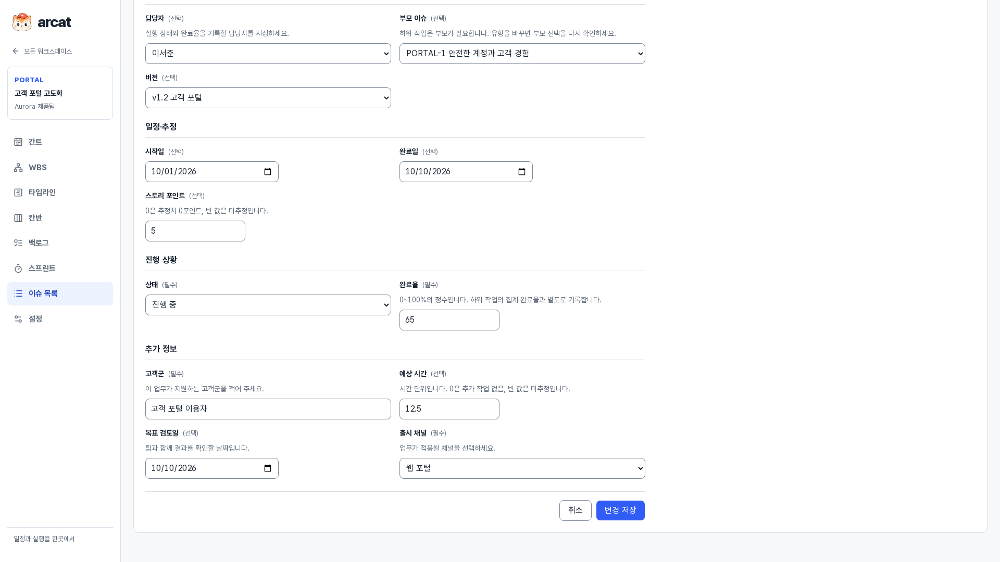](images/ticket-custom-form.png)

**사용자:** 기본·프로젝트 관리자 · **화면:** `/projects/:projectId/issues/:issueId` · 화면 하단 기능으로 스크롤

이 기능에서 할 수 있는 일:

- 텍스트·숫자·날짜·선택 입력
- 0과 미추정 구분
- 필드별 입력 안내
- 담당자의 실행 수정은 기존 범위 유지

## 필드별 검증과 입력 내용 보존

잘못된 입력을 저장하기 전에 오류 요약과 해당 필드의 설명으로 안내합니다.

[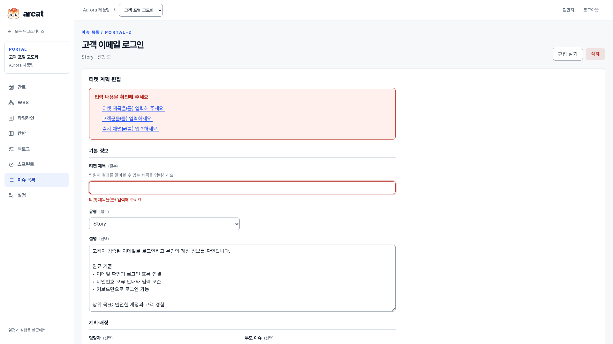](images/ticket-validation.png)

**사용자:** 티켓 편집 사용자 · **화면:** `/projects/:projectId/issues/:issueId` · 화면 상단

이 기능에서 할 수 있는 일:

- Valibot 입력 검증
- 필수 오류·필드 오류 연결
- 오류 요약에서 입력으로 이동
- 오류에도 작성한 다른 값 보존

## 저장된 팀별 추가 정보 확인

티켓 상세에서 팀이 정한 추가 정보를 읽고 계획·실행 맥락을 공유합니다.

[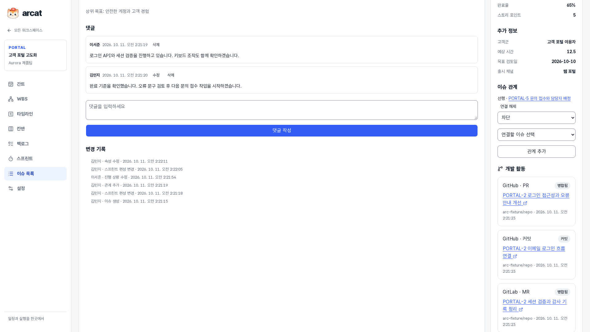](images/ticket-custom-detail.png)

**사용자:** 모든 팀원 · **화면:** `/projects/:projectId/issues/:issueId` · 화면 하단 기능으로 스크롤

이 기능에서 할 수 있는 일:

- 표시 이름과 타입별 값
- 단일 선택의 선택지 이름
- 일반 팀원의 조회
- 필드 비활성화 후 기존 값 보존
