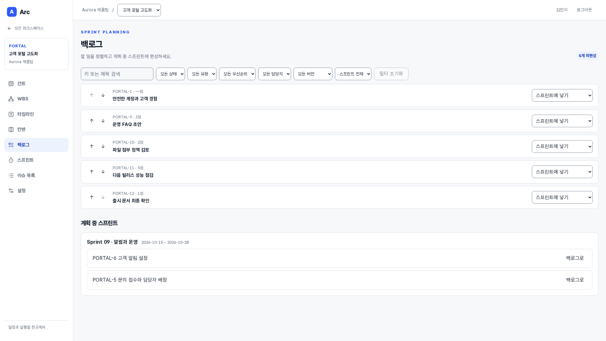
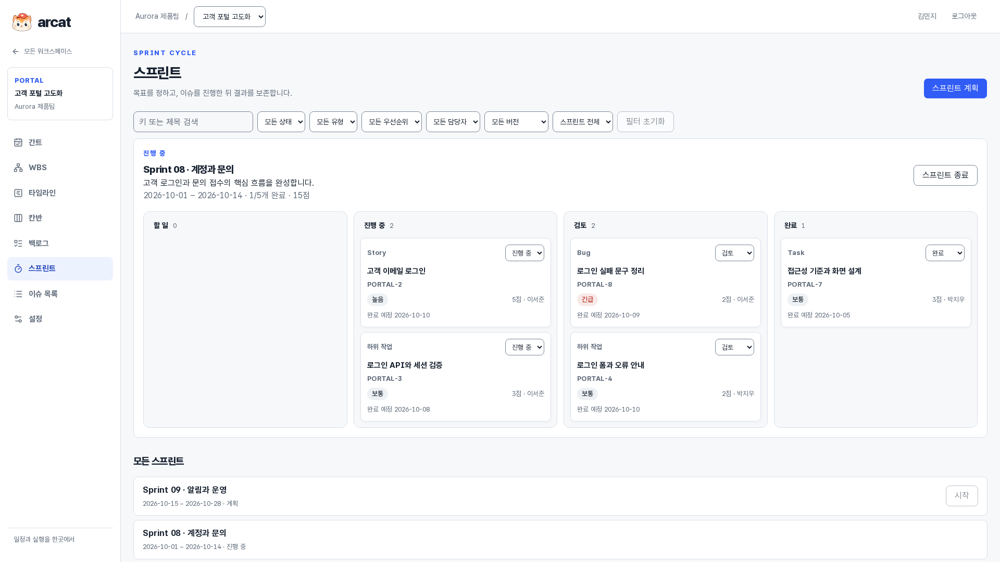
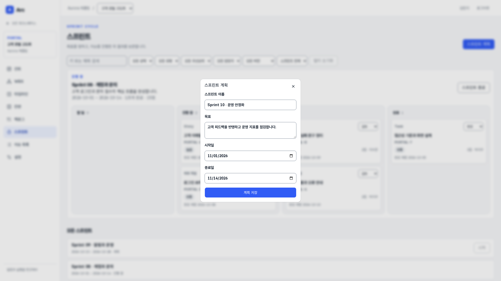
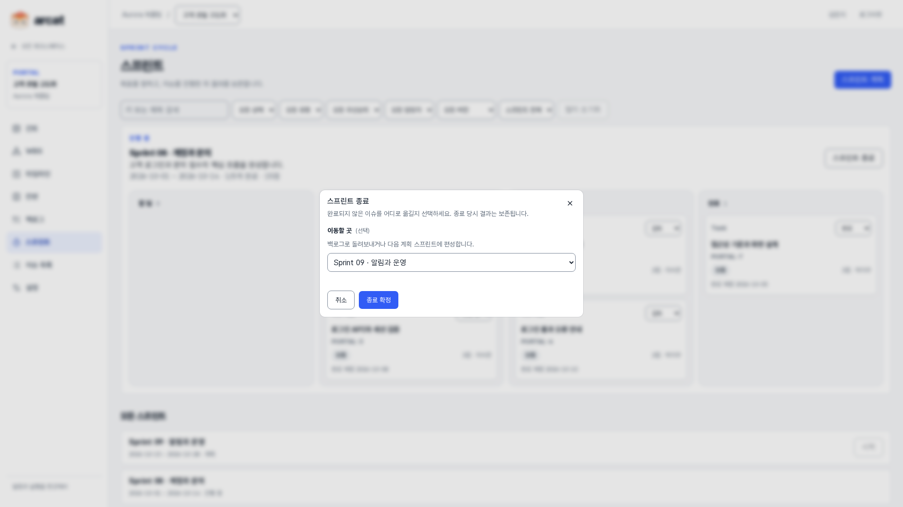
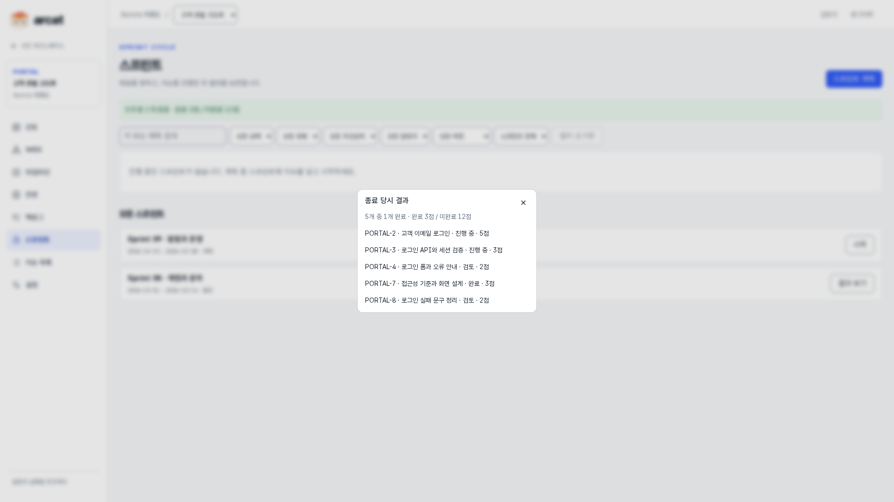

# 백로그와 스프린트

[제품 소개](README.md) · [전체 기능 안내](FEATURES.md)

관리자는 백로그와 스프린트를 편성하고, 담당자는 진행 중 업무를 수행합니다. 종료 시 미완료 업무를 이월하고 당시 결과를 보존합니다.

> 2026-10-08 · Asia/Seoul · 실제 앱 촬영 · 모든 원본 1920×1080

사진을 누르면 원본을 볼 수 있습니다. 동일한 데모 팀의 업무 흐름을 순서대로 촬영했으며 스프린트 종료·보관 전후에는 상태가 달라집니다.

## 백로그와 스프린트 편성

미편성 업무의 우선순위를 정하고 계획 중 스프린트에 넣습니다.

**사용자:** 모든 팀원·관리자 · **화면:** `/projects/:projectId/backlog` · 화면 상단

이 기능에서 할 수 있는 일:

- 백로그 순서 변경
- 스프린트 편성·백로그 복귀
- 공통 필터
- 관리자 계획 권한

## 진행 중 스프린트

스프린트 목표·기간·완료 수·포인트와 상태별 업무를 확인합니다.

**사용자:** 모든 팀원 · **화면:** `/projects/:projectId/sprints` · 화면 상단

이 기능에서 할 수 있는 일:

- 스프린트 보드
- 담당 티켓 상태 변경
- 목표·기간
- 완료·포인트 요약

## 새 스프린트 계획

목표와 기간을 지정해 다음 스프린트를 준비합니다.

**사용자:** 기본·프로젝트 관리자 · **화면:** `/projects/:projectId/sprints` · 화면 상단

이 기능에서 할 수 있는 일:

- 이름·목표·시작일·종료일
- 계획 상태 생성
- 기간 검증
- 프로젝트당 진행 스프린트 하나

## 스프린트 종료와 이월

미완료 티켓을 백로그 또는 다음 계획 스프린트로 이월합니다.

**사용자:** 기본·프로젝트 관리자 · **화면:** `/projects/:projectId/sprints` · 화면 상단

이 기능에서 할 수 있는 일:

- 종료 확인
- 미완료 업무 이동 선택
- 완료·미완료 포인트 결과
- 종료 이력 보존

## 종료 당시 스프린트 결과

티켓이 다음 스프린트로 이동해도 종료 당시 상태와 포인트를 다시 확인합니다.

**사용자:** 모든 팀원 · **화면:** `/projects/:projectId/sprints` · 화면 상단

이 기능에서 할 수 있는 일:

- 종료 시점 티켓 목록
- 완료·미완료 수·포인트
- 당시 상태 보존
- 재시작 불가
