# 설정과 개발 도구 연동

[제품 소개](README.md) · [전체 기능 안내](FEATURES.md)

프로젝트 관리 범위와 팀 역할, 워크스페이스 티켓 필드를 설정하고 GitHub·GitLab 개발 활동을 티켓에 연결합니다. 빈 프로젝트와 보관 프로젝트의 동작도 확인합니다.

> 2026-10-11 · Asia/Seoul · 실제 앱 촬영 · 모든 원본 1920×1080

사진을 누르면 원본을 볼 수 있습니다. 동일한 데모 팀의 업무 흐름을 순서대로 촬영했으며 스프린트 종료·보관 전후에는 상태가 달라집니다.

연동 사진은 로컬 GitHub·GitLab 제공자 모형으로 저장소 확인과 서명된 웹훅을 처리한 실제 앱 화면입니다. 실제 외부 계정 연결의 증빙은 아니며, 설치 후 [연동 안내](../INTEGRATIONS.md)에 따라 설정합니다.

## 프로젝트 설정과 관리자

프로젝트 정보와 기본·추가 관리자를 확인하고 관리 범위를 지정합니다.

[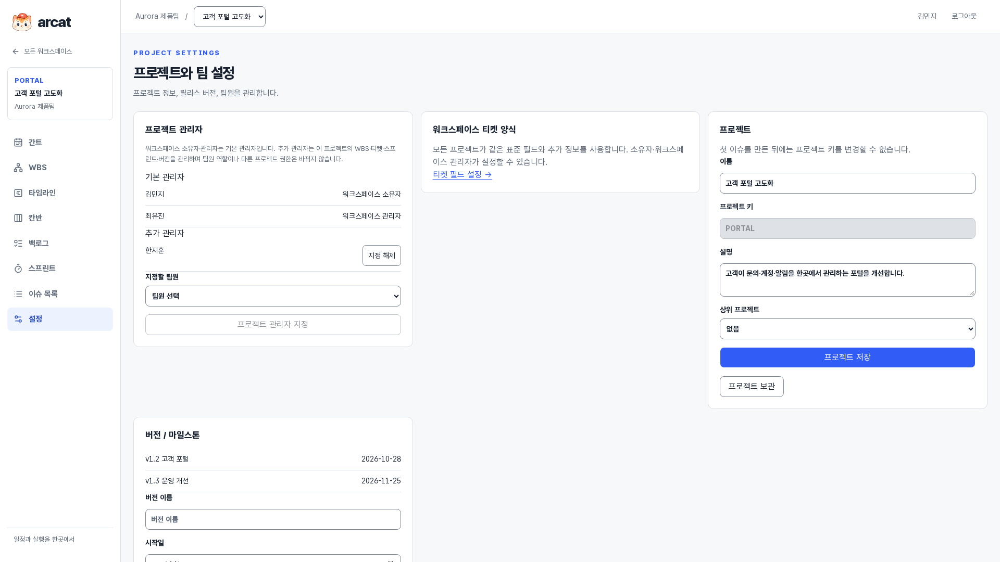](images/project-settings.png)

**사용자:** 모든 팀원·워크스페이스 관리자 · **화면:** `/projects/:projectId/settings` · 화면 상단

이 기능에서 할 수 있는 일:

- 프로젝트 이름·키·설명·부모
- 기본 OWNER·ADMIN
- 프로젝트 관리자 지정·해제
- 첫 티켓 후 키 변경 제한

## 버전 일정 관리

릴리스 묶음의 시작·완료일을 등록하고 티켓과 일정 보기에 연결합니다.

[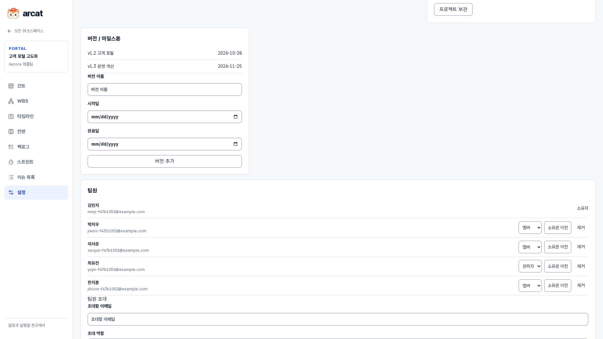](images/version-settings.png)

**사용자:** 기본·프로젝트 관리자 · **화면:** `/projects/:projectId/settings` · 화면 하단 기능으로 스크롤

이 기능에서 할 수 있는 일:

- 릴리스 버전
- 시작일·완료일
- 티켓 버전 연결
- 일정 상속

## 팀원 역할·초대 관리

팀원을 초대하고 워크스페이스 역할·소유권·멤버십을 관리합니다.

[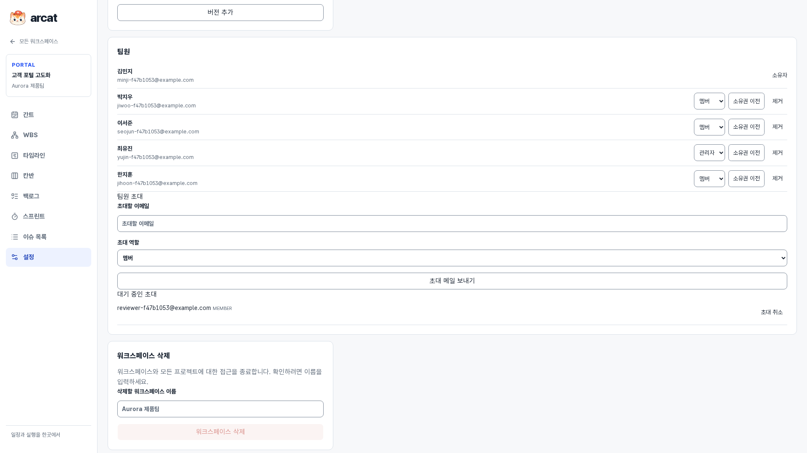](images/team-settings.png)

**사용자:** 워크스페이스 소유자·관리자 · **화면:** `/projects/:projectId/settings` · 화면 하단 기능으로 스크롤

이 기능에서 할 수 있는 일:

- 이메일 초대·취소·만료
- MEMBER·ADMIN
- 소유권 이전
- 멤버 제거와 프로젝트 지정 해제

## 프로젝트 보관과 워크스페이스 삭제

프로젝트는 보관·복원하고 워크스페이스 접근 종료는 이름 확인을 거칩니다.

[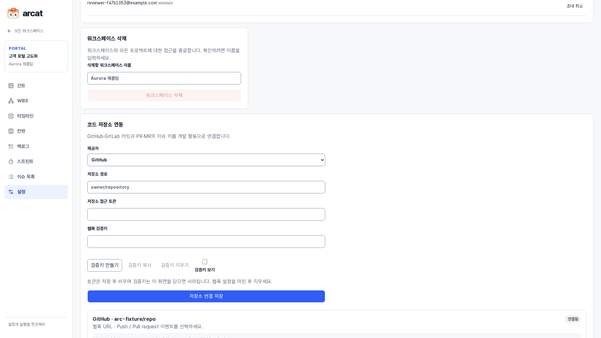](images/workspace-lifecycle.png)

**사용자:** 워크스페이스 소유자·관리자 · **화면:** `/projects/:projectId/settings` · 화면 하단 기능으로 스크롤

이 기능에서 할 수 있는 일:

- 프로젝트 보관·복원
- 소유자만 워크스페이스 삭제
- 이름 확인
- 읽기 전용 상태

## GitHub·GitLab 저장소 연결

저장소를 연결하고 웹훅·접근 권한·연결 상태를 관리합니다.

[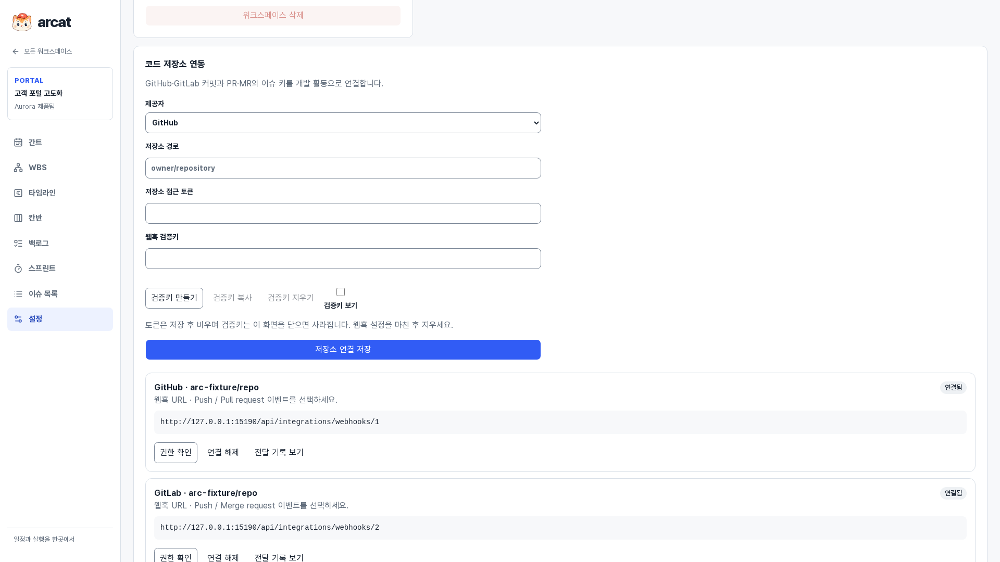](images/repository-integrations.png)

**사용자:** 워크스페이스 소유자·관리자 · **화면:** `/projects/:projectId/settings` · 화면 하단 기능으로 스크롤

이 기능에서 할 수 있는 일:

- GitHub·GitLab
- 접근 토큰 암호화
- 웹훅 검증키
- 권한 확인·연결 해제
- 입력 토큰 저장 후 비움

## 웹훅 전달 기록

수신 이벤트의 처리 상태와 시도 횟수를 확인하고 실패 전달을 다시 시도합니다.

[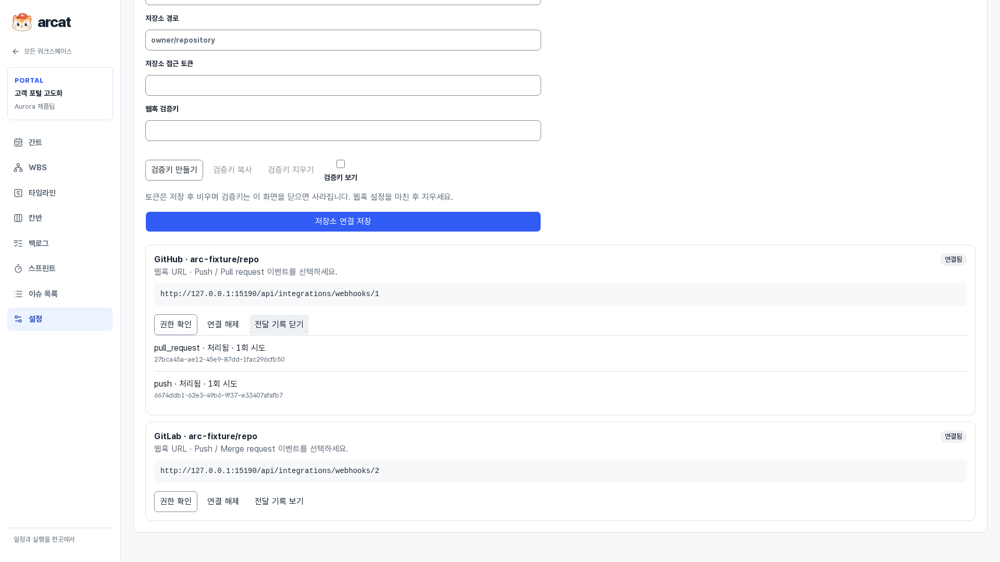](images/webhook-deliveries.png)

**사용자:** 워크스페이스 소유자·관리자 · **화면:** `/projects/:projectId/settings` · 화면 하단 기능으로 스크롤

이 기능에서 할 수 있는 일:

- 전달 ID·이벤트·시도 횟수
- 처리·대기·실패 상태
- 실패 재시도
- 중복 전달 제거

## 티켓에 연결된 커밋·PR·MR

티켓 키로 연결된 GitHub·GitLab 개발 기록을 업무 상세에서 확인합니다.

[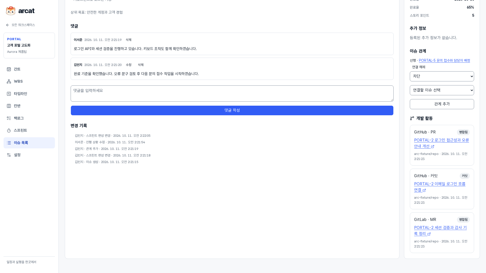](images/development-activity.png)

**사용자:** 모든 팀원 · **화면:** `/projects/:projectId/issues/:issueId` · 화면 하단 기능으로 스크롤

이 기능에서 할 수 있는 일:

- 커밋·PR·MR 연결
- 열림·닫힘·병합 상태
- 제공자 원본 링크
- 이슈 상태 자동 변경 없음

## 팀에 맞는 표준 티켓 필드

필드 이름·입력 안내·표시 여부·필수 여부·순서를 워크스페이스 단위로 정합니다.

[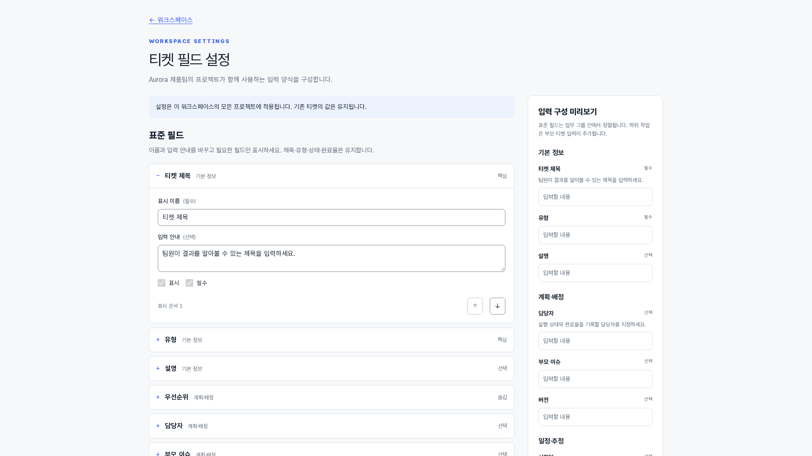](images/ticket-fields-standard.png)

**사용자:** 워크스페이스 소유자·관리자 · **화면:** `/workspaces/:workspaceId/ticket-fields` · 화면 상단

이 기능에서 할 수 있는 일:

- 모든 프로젝트에 같은 양식 적용
- 핵심 제목·유형·상태·완료율 유지
- 숨긴 필드의 기존 값 보존
- 저장 전 입력 구성 미리보기

## 커스텀 필드와 입력 구성 미리보기

텍스트·숫자·날짜·단일 선택 정보를 추가하고 팀의 입력 양식을 확인합니다.

[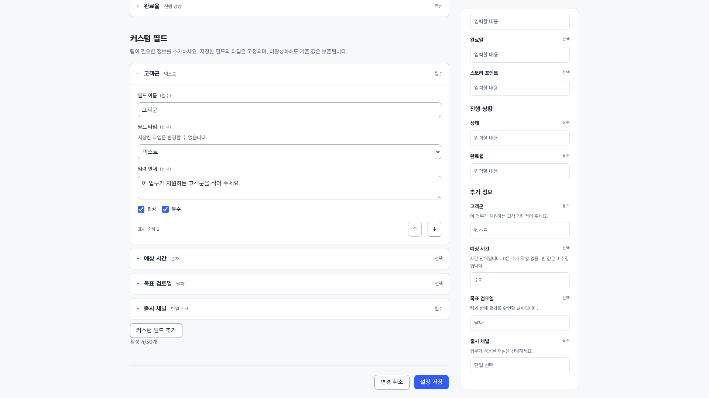](images/ticket-fields-custom.png)

**사용자:** 워크스페이스 소유자·관리자 · **화면:** `/workspaces/:workspaceId/ticket-fields` · 화면 하단 기능으로 스크롤

이 기능에서 할 수 있는 일:

- 활성 필드 최대 30개
- 필수·선택·설명·순서 설정
- 저장 후 타입 고정
- 필드·선택지 비활성화와 기존 값 보존

## 프로젝트 시작 전 빈 상태

업무가 없는 프로젝트에서는 0건과 업무 없음을 표시하고 첫 티켓을 만들 수 있습니다.

[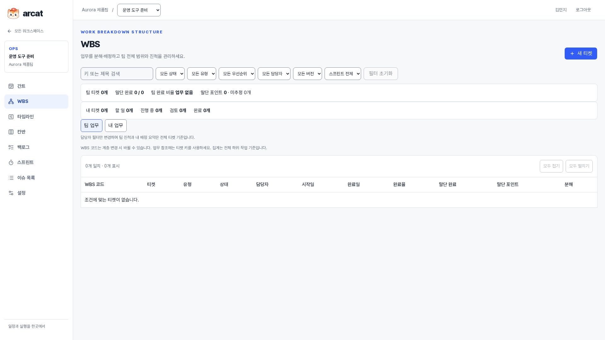](images/empty-project.png)

**사용자:** 모든 팀원·관리자 · **화면:** `/projects/:projectId/wbs` · 화면 상단

이 기능에서 할 수 있는 일:

- 빈 결과 안내
- 완료로 오해하지 않는 팀 집계
- 첫 티켓 생성

## 보관 프로젝트의 읽기 전용 WBS

지난 프로젝트의 업무·진척은 남겨 두면서 변경을 제한합니다.

[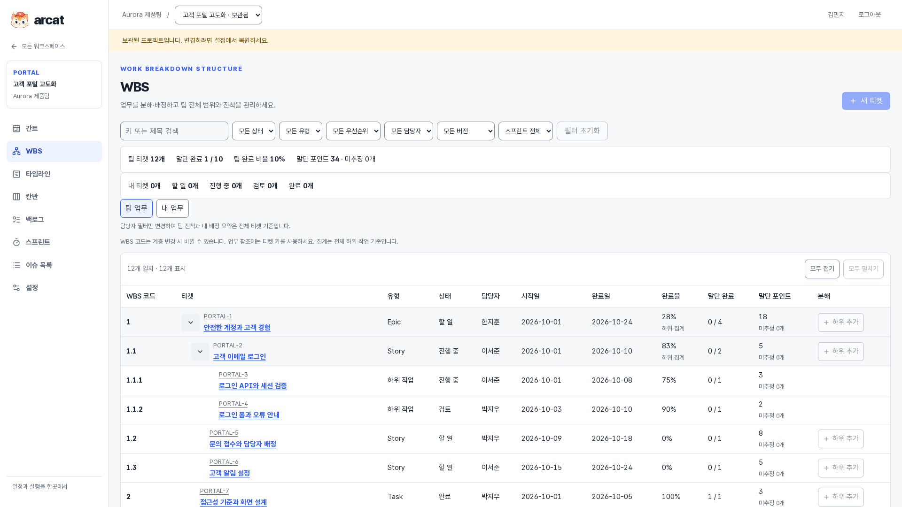](images/archived-project.png)

**사용자:** 모든 팀원 · **화면:** `/projects/:projectId/wbs` · 화면 상단

이 기능에서 할 수 있는 일:

- 보관 안내
- 변경 버튼 비활성
- 조회·필터·접기 가능
- 관리자 복원
