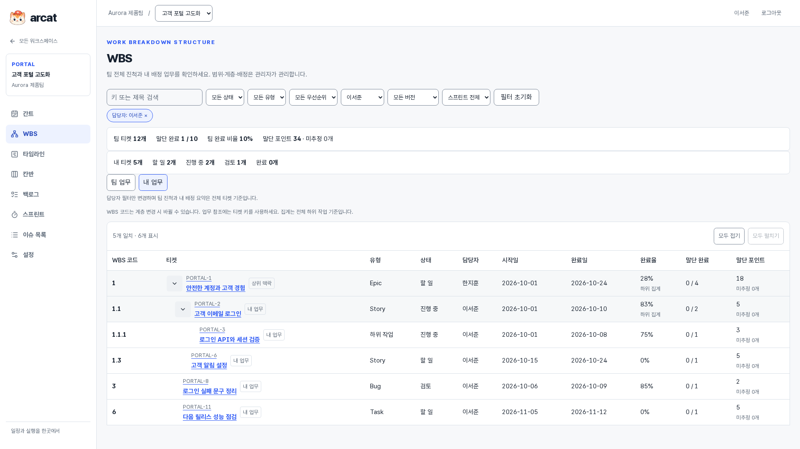

# Arc 제품 둘러보기

**관리자의 계획과 개발자의 실행을 하나의 티켓으로 연결합니다.** WBS로 업무를 나누고, 간트로 일정과 관계를 확인하고, 칸반·스프린트로 진행합니다. 모든 보기는 같은 티켓의 상태·담당자·일정을 사용합니다.

[프로젝트 README](../../README.md) · [전체 기능·권한](FEATURES.md) · [설치 안내](../DEPLOYMENT.md)

## 우리 팀에 맞는지 확인하기

| 확인할 점 | Arc에서 확인할 화면 |
| --- | --- |
| 프로젝트 관리자가 범위와 배정을 관리하나요? | [관리자 WBS](02-planning-and-schedule.md#wbs-manager) · [프로젝트 관리자 지정](05-settings-and-integrations.md#project-settings) |
| 개발자가 내 업무와 팀 진척을 함께 봐야 하나요? | [개발자 WBS](02-planning-and-schedule.md#wbs-developer) · [상태·완료율 수정](03-tickets-and-views.md#ticket-execution) |
| 부모·자식 일정과 선행 관계가 중요한가요? | [간트](02-planning-and-schedule.md#gantt) · [계층 접기](02-planning-and-schedule.md#gantt-collapse) · [타임라인](02-planning-and-schedule.md#timeline-epic) |
| 표·칸반·스프린트를 함께 사용하나요? | [티켓 테이블](03-tickets-and-views.md#ticket-table) · [칸반](03-tickets-and-views.md#kanban) · [스프린트](04-sprints.md) |
| 코드 변경을 업무와 연결해야 하나요? | [GitHub·GitLab 연결](05-settings-and-integrations.md#repository-integrations) · [티켓 개발 활동](05-settings-and-integrations.md#development-activity) |

## 전체 화면 안내

실제 제품 사진 **41장**을 5개 장으로 구성했습니다. 각 장에는 화면 원본과 목적, 사용자 역할, 세부 기능 설명을 함께 제공합니다. 인증 4개 화면, 워크스페이스, 프로젝트의 간트·WBS·타임라인·칸반·백로그·스프린트·티켓 목록·설정, 티켓 상세 및 생성·편집·결과 대화상자를 포함합니다.

| 장 | 둘러볼 화면 |
| --- | --- |
| [1. 팀 공간 시작하기](01-team-and-access.md) | 로그인, 가입, 이메일 확인, 초대 수락, 팀 공간, 프로젝트 생성 |
| [2. WBS와 일정 계획](02-planning-and-schedule.md) | 간트·중첩 접기·개인 보기·선택 상세, 관리자/개발자 WBS, 하위 티켓, Epic/버전 타임라인, 미계획 업무 |
| [3. 티켓 실행과 협업](03-tickets-and-views.md) | 담당자 실행 수정, 테이블·열 선택, 티켓 생성·상세·관계·기록·댓글·계획 편집·충돌, 칸반 |
| [4. 백로그와 스프린트](04-sprints.md) | 백로그, 진행 스프린트, 계획, 종료·이월, 종료 당시 결과 |
| [5. 설정과 개발 도구 연동](05-settings-and-integrations.md) | 프로젝트·관리자, 버전, 팀·초대, 보관·삭제, 저장소·웹훅 기록, 개발 활동, 빈 상태·보관 상태 |

## 실제 업무 흐름

1. **팀 구성:** 워크스페이스 소유자가 팀 공간과 프로젝트를 만들고 이메일로 팀원을 초대합니다.
2. **계획:** 기본 관리자와 프로젝트별 추가 관리자가 Epic·Story·작업으로 범위를 분해하고 담당자·날짜·버전·포인트를 지정합니다.
3. **일정 확인:** 간트에서 부모·자식과 선행·차단 관계를 보고, 타임라인에서 Epic별 또는 버전별 계획을 비교합니다.
4. **실행·협업:** 개발자가 내 티켓의 상태·완료율을 바꾸고 모든 팀원이 댓글과 개발 활동으로 협업합니다.
5. **회고:** 스프린트를 종료하고 미완료 티켓을 다음 스프린트나 백로그로 보냅니다. 종료 당시 결과는 남습니다.

계획 권한은 프로젝트 단위이며 팀·프로젝트 설정·저장소 자격 증명 권한과 구분됩니다. [역할표](FEATURES.md#역할과-권한)에서 확인하세요.

## 사진과 구현 범위

사진은 **2026-10-08, Asia/Seoul**에 ‘Aurora 제품팀 / 고객 포털 고도화’를 실제 웹 앱·API·MySQL에서 실행하여 촬영했습니다. **모든 원본은 1920×1080**이며 합성 시안이 아닙니다. 주요 프로젝트 12개 티켓과 하위 프로젝트 1개 티켓을 사용하고, 관리자와 개발자 계정을 바꿔 권한 차이를 보여 줍니다. 스프린트 종료·보관 전후 사진은 동일 데이터의 서로 다른 시점입니다.

GitHub·GitLab 사진은 **로컬 제공자 모형**으로 저장소 확인과 서명된 웹훅을 처리한 실제 Arc 화면입니다. 실계정 연결·운영 배포의 증빙으로 사용하지 않습니다. 버전 일정은 현재 제공하지만 독립 마일스톤의 달성 관리는 아직 구현하지 않았습니다. [현재 범위와 후속 기능](FEATURES.md#선택하기-전에-확인할-범위)을 확인하세요.

사진을 클릭하면 각 설명 또는 원본으로 이동합니다. 전체 원본은 [images](images)에, 촬영일·원본 해상도·앱 코드 커밋·화면 경로는 [사진 목록](screenshots.json)에 기록했습니다. 새 설치에는 이 데모 데이터가 자동으로 생성되지 않습니다.

자료 유지관리: [사진 재촬영과 설명 갱신](../../scripts/product/README.md).
